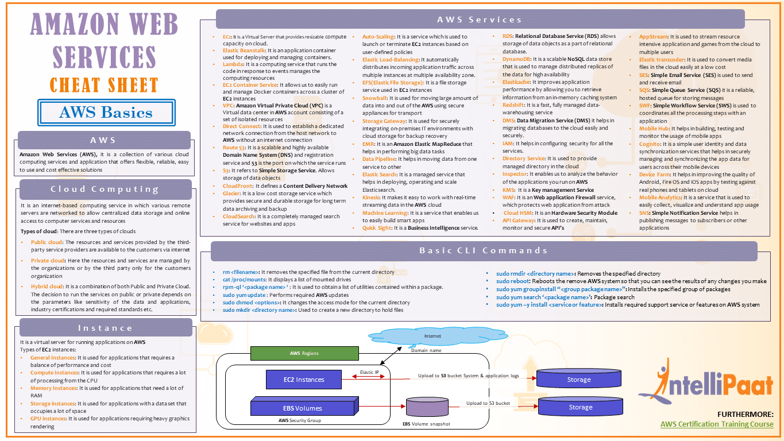

## Quick Overview

The notes listed here are high-level, cheatsheets, and for a quick reminder.

#### Serverless Services
Compute
- Lambda
- AWS Fargate

Application Integration
- Amazon Eventbridge
- AWS Step Functions
- Amazon SQS
- Amazon SNS
- Amazon API Gateway
- AWS AppSync

Data Store
- Amazon S3
- Amazon EFS
- Amazon DynamoDB
- Amazon RDS Proxy
- Amazon Aurora Serverless
- Amazon Redshift Serverless
- Amazon Neptune Serverless
- Amazon OpenSearch Serverless
- Amazon ElastiCache Serverless

#### Services Cheat Sheet
- https://intellipaat.com/blog/tutorial/amazon-web-services-aws-tutorial/aws-cheat-sheet/
  - 
- https://cheatography.com/irohitpawar/cheat-sheets/aws-services/
