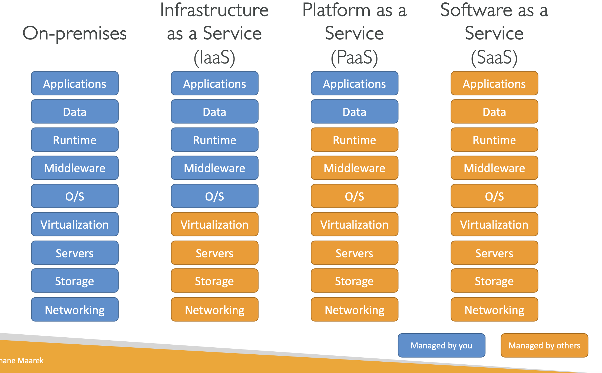

## Cloud Computing Basics
Cloud computing is the on-demand delivery of compute power database storage, applications, and other IT resources.

- Through a cloud services platform with **pay-as-you-go pricing**
- You can **provision exactly the right type and size of computing resources** you need
- You can access as many resources as you need, almost **instantly**
- Simple way to access **servers, storage, databases and a set of application services**

#### Private Cloud:
- Cloud services used by a single organization, not exposed to the public.
- Complete control
- Security for sensitive applications
- Meet specific business needs

#### Public Cloud:
- Cloud resources owned and operated by a third- party cloud service provider delivered over the Internet.
- Six Advantages of Cloud Computing

#### Hybrid Cloud:
- Keep some servers on premises and extend some capabilities to the Cloud
- Control over sensitive assets in your private infrastructure
- Flexibility and cost- effectiveness of the public cloud

#### Five Characteristics of Cloud Computing:
1. On-demand self service:
2. Broad network access:
3. Multi-tenancy and resource pooling:
4. Rapid elasticity and scalability:
5. Measured service

#### Six Advantages of Cloud Computing:
1. Trade capital expense (CAPEX) for operational expense (OPEX) 
    - Pay On-Demand: don’t own hardware
    - ReducedTotal Cost of Ownership (TCO) & Operational Expense (OPEX)
2. Benefit from massive economies of scale
3. Stop guessing capacity
4. Increase speed and agility
5. Stop spending money running and maintaining data centers 
6. Go global in minutes

#### Problems solved by the Cloud:
- Flexibility
- Cost-Effectiveness
- Scalability
- Elasticity
- High Availability and fault tolerance

#### Types of Cloud Computing:
- 

#### 3 Pricing of the Cloud:
- AWS follows pay-as-you-go principle
    - Compute
      - Pay for compute time
    - Storage
      - Pay for data storage in the Cloud
    - Data
      - Pay for data transfer **OUT NOT IN** in Cloud. (*IN IS FREE*)
