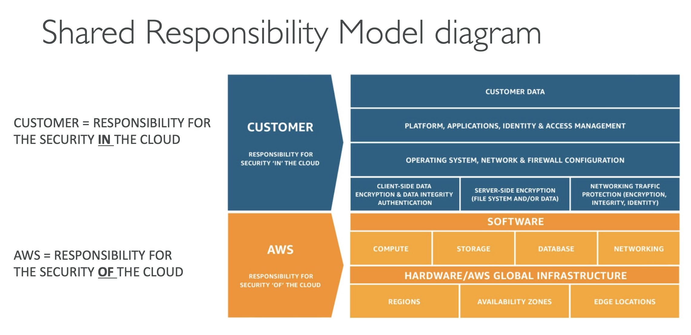

## AWS Infrastructure

#### Consists of:
- Regions
- Availability Zones (AZ)
- Data Centers
- Edge Locations / Point of Presence

#### Choose AWS Regions by:
- **Compliance** with data governance and legal requirements
- **Proximity** to customers
- **Available** services within a Region
- **Pricing**

#### Availability Zones (AZ):
- region has multiple AZs
- each AZ 
  - has one or more discrete data centers
  - separate from each other to isolate disasters
  - high bandwidth, ultra-low latency networking

#### Points of Presence (Edge Locations):
- Content is delivered to end users with lower latency

#### Shared Responsibility Model:
- 