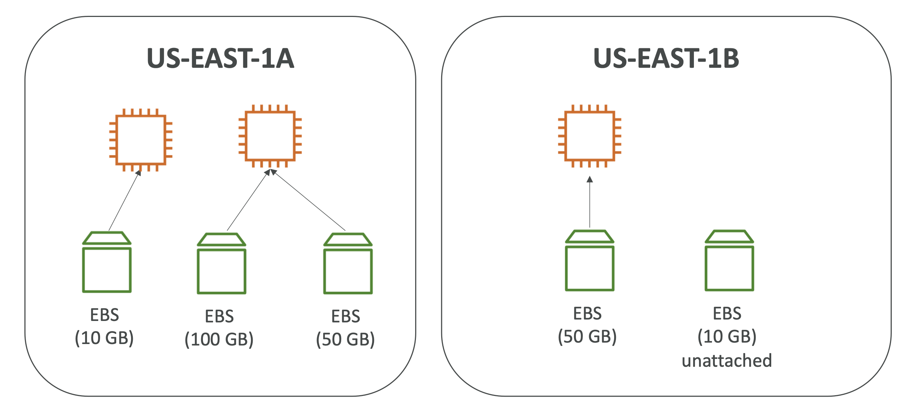
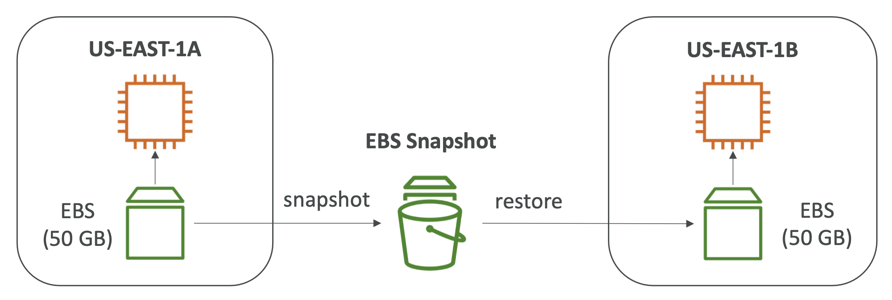
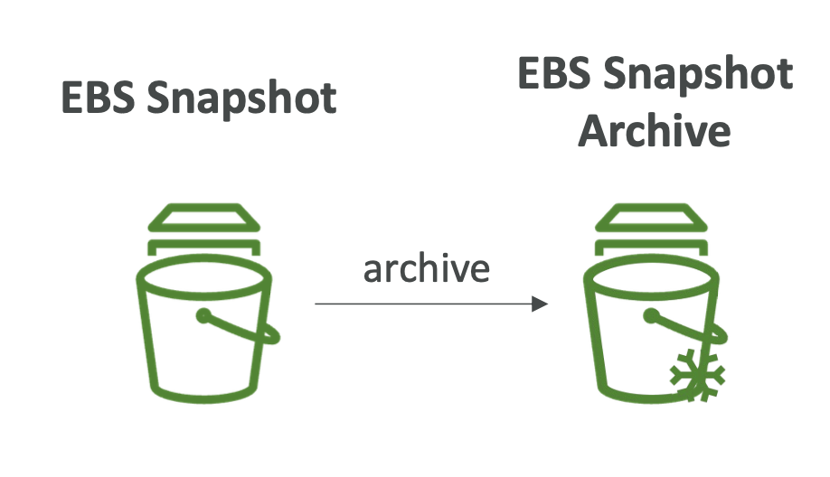
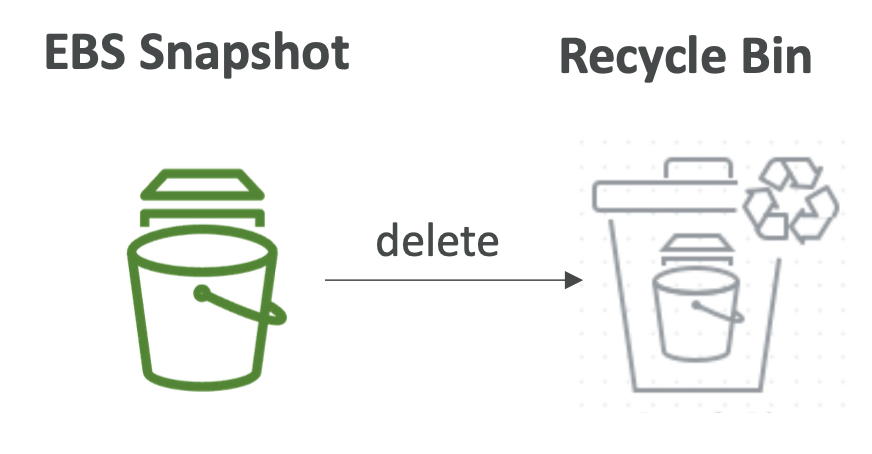
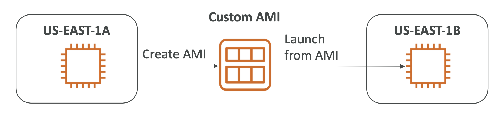
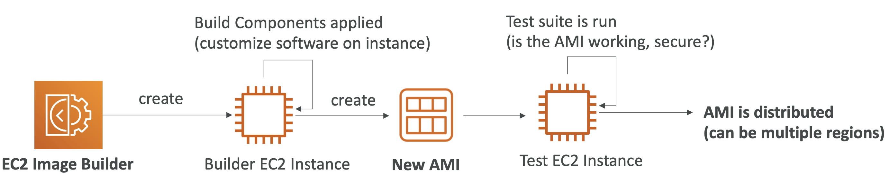
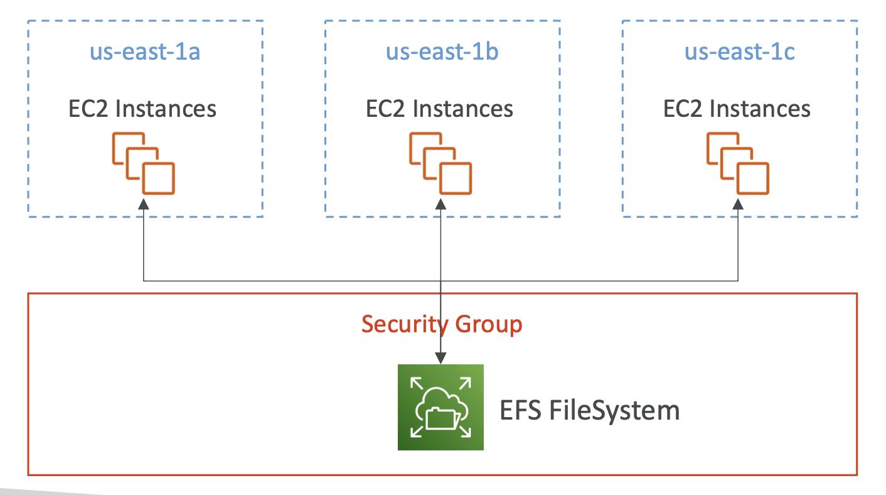
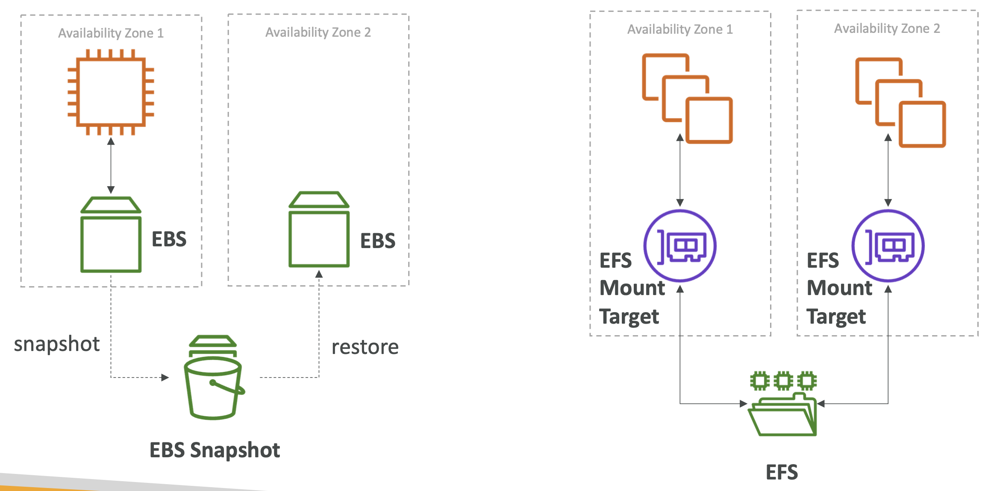
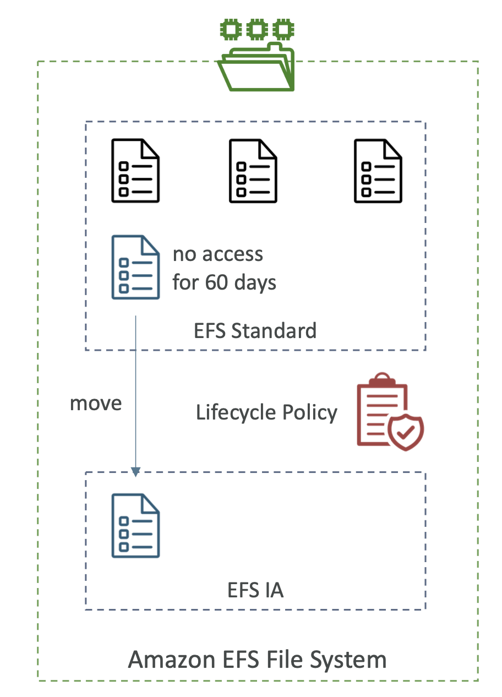

## EC2 Instances Storages

#### Elastic Block Store (EBS) Volumes
- it's a network drive
- locked to AZ
- can only be mounted to one instance at a time
- provisioned capacity
- By default, the root EBS volume is deleted (attribute enabled)
- By default, any other attached EBS volume is not deleted (attribute disabled)
- 

#### EBS Snapshots
- backup (snapshot) of your EBS volume at a point in time
- copy snapshots across AZ or Region
- 

- EBS Snapshot Archive
  - Move a Snapshot to an ”archive tier” that is
75% cheaper
  - Takes within 24 to 72 hours for restoring the archive
  - 

- Recycle Bin for EBS Snapshots
  - Setup rules to retain deleted snapshots so you can recover them after an accidental deletion
  - Specify retention (from 1 day to 1 year)
  - 

#### Amazon Machine Image (AMI)
- customization of an EC2 instance
  - You add your own software, configuration, operating system, monitoring... 
  - Faster boot / configuration time because all your software is pre-packaged
- built for a specific region
- EC2 instances from:
  - A Public AMI: AWS provided
  - Your own AMI: you make and maintain them yourself
  - An AWS Marketplace AMI: an AMI someone else made (and potentially sells)
- 

#### EC2 Image Builder
- automate the creation ofVirtual Machines or container images
- Automate the creation, maintain, validate and test EC2 AMIs
- Can be run on a schedule 
- 

#### EC2 Instance Store
- EBS has limited performance so, if you need a high-performance hardware disk, use EC2 Instance Store.
- Better I/O performance
- EC2 Instance Store lose their storage if they’re stopped (ephemeral)
- Good for buffer / cache / scratch data / temporary content
- Risk of data loss if hardware fails
- Backups and Replication are your responsibility

#### Elastic File System (EFS)
- Managed NFS (network file system) that can be mounted on 100s of EC2
- EFS works with Linux EC2 instances in multi-AZ
- Highly available, scalable, expensive (3x gp2), pay per use, no capacity planning
- 

#### EBS vs EFS
- 

#### EFS Infrequent Access (EFS-IA)
- Storage class that is cost-optimized for files not accessed every day
- EFS will automatically move your files to EFS-IA
based on the last time they were accessed
- Example: move files that are not accessed for 60 days to EFS-IA
- 

#### Shared Responsibility Model for EC2 Storage
**AWS:**
- Infrastructure
- Replication for data for EBS
volumes & EFS drives
- Replacing faulty hardware
- Ensuring their employees cannot access your data

**YOU:**
- Setting up backup / snapshot procedures
- Setting up data encryption
- Responsibility of any data on
the drives
- Understanding the risk of using EC2 Instance Store

#### Amazon FSx
- 3rd party high-performance file systems on AWS
- FSx for Lustre, Windows File Server, NetApp ONTAP

**FSx for Windows File Server**
- Windows native shared file system
- Windows File Server

**FSx for Lustre**
- A fully managed, high-performance, scalable file storage for High Performance Computing (HPC)
- Lustre is derived from “Linux” and “cluster”.

#### EC2 Instance Storage - Summary
- **EBS volumes:**
  - network drives attached to one EC2 instance at a time
  - Mapped to an AvailabilityZones
  - Can use EBS Snapshots for backups / transferring EBS volumes across AZ
- **AMI:** create ready-to-use EC2 instances with our customizations
- **EC2 Image Builder:** automatically build, test and distribute AMIs
- **EC2 Instance Store:**
  - High performance hardware disk attached to our EC2 instance 
  - Lost if our instance is stopped / terminated
- **EFS:** network file system, can be attached to 100s of instances in a region 
- **EFS-IA:** cost-optimized storage class for infrequent accessed files
- **FSx for Windows:** Network File System for Windows servers
- **FSx for Lustre:** High Performance Computing Linux file system