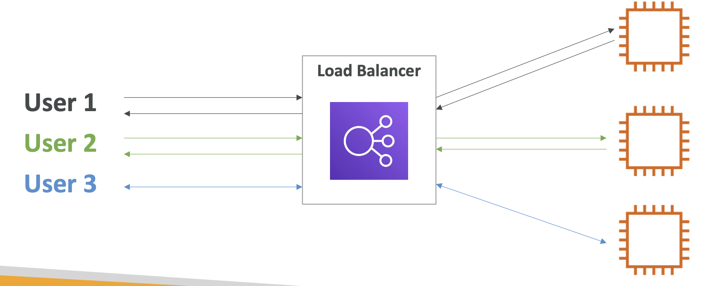
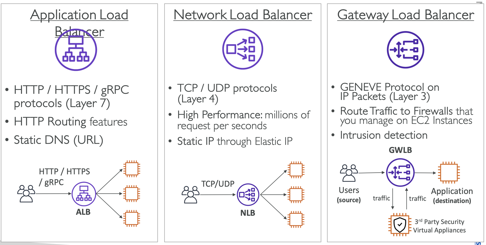

## Elastic Load Balancer (ELB) & Auto Scaling Groups (ASG)

**Vertical Scalability**
- means increasing the size of the instance
- example: t2.micro -> t2.large

**Horizontal Scalability**
- means increasing the number of instances / systems for your application
- Auto Scaling Group
- Load Balancer

**High Availability**
- means running your application / system in at least 2 

**Availability Zones**
- avoids disaster situations
- Auto Scaling Group multi AZ
- Load Balancer multi AZ

**Scalability:**
- ability to accommodate a larger load by making the hardware stronger (scale up), or by adding nodes (scale out)

**Elasticity:** 
- once a system is scalable, elasticity means that there will be some “auto-scaling” so that the system can scale based on the load.This is “cloud-friendly”: pay-per-use, match demand, optimize costs

**Agility:**
- (not related to scalability - distractor) new IT resources are only a click away, which means that you reduce the time to make those resources available to your developers from weeks to just minutes.

**Load Balancer:**
- Spread load across multiple downstream instances
- Do regular health checks to your instances
- 

#### Elastic Load Balancer (ELB)
- managed load balancer
- 4 Types:
  - Application Load Balancer (HTTP / HTTPS only) – Layer 7
  - Network Load Balancer (TCP) – Layer 4
  - Gateway Load Balancer – Layer 3
  - Classic Load Balancer (retired in 2023) – Layer 4 & 7
  - 

#### Auto Scaling Groups (ASG)
- Scale out (add EC2 instances) to match an increased load
- Scale in (remove EC2 instances) to match a decreased load

**Manual Scaling:**
- Update the size of an ASG manually

**Dynamic Scaling:**
- Simple / Step Scaling
  - When a CloudWatch alarm is triggered (example CPU > 70%), then add 2 units 
  - When a CloudWatch alarm is triggered (example CPU < 30%), then remove 1
- Target Tracking Scaling
  - Example: I want the average ASG CPU to stay at around 40%
- Scheduled Scaling
  - Anticipate a scaling based on known usage patterns
  - Example: increase the min. capacity to 10 at 5 pm on Fridays
- Predictive Scaling
  - Uses Machine Learning to predict future traffic ahead of time

#### ELB & ALB - Summary
- High Availability vs Scalability (vertical and horizontal) vs Elasticity vs Agility in the Cloud
- Elastic Load Balancers (ELB)
  - Distribute traffic across backend EC2 instances, can be Multi-AZ
  - Supports health checks
  - 4 types: Classic (old), Application (HTTP – L7), Network (TCP – L4), Gateway (L3)
- Auto Scaling Groups (ASG)
  - Implement Elasticity for your application, across multiple AZ
  - Scale EC2 instances based on the demand on your system, replace unhealthy
  - Integrated with the ELB