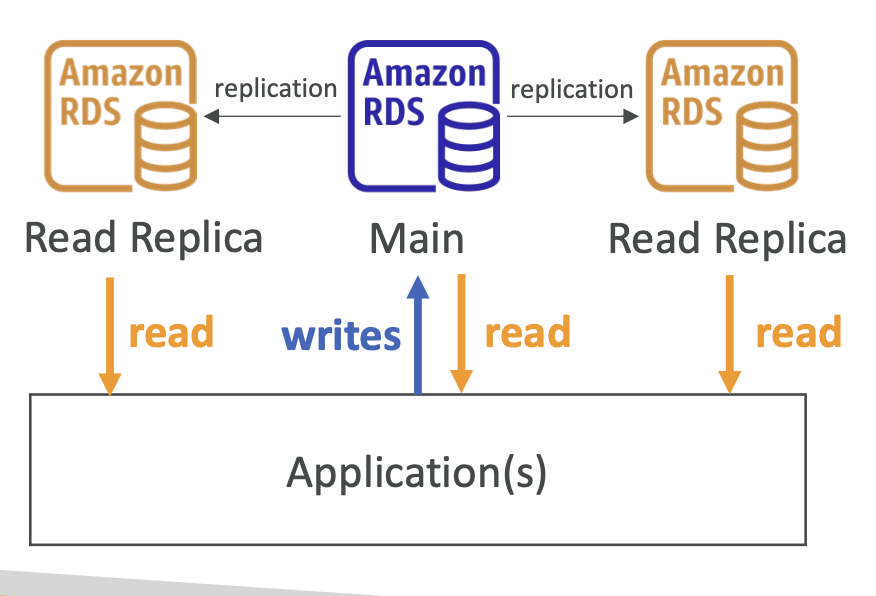
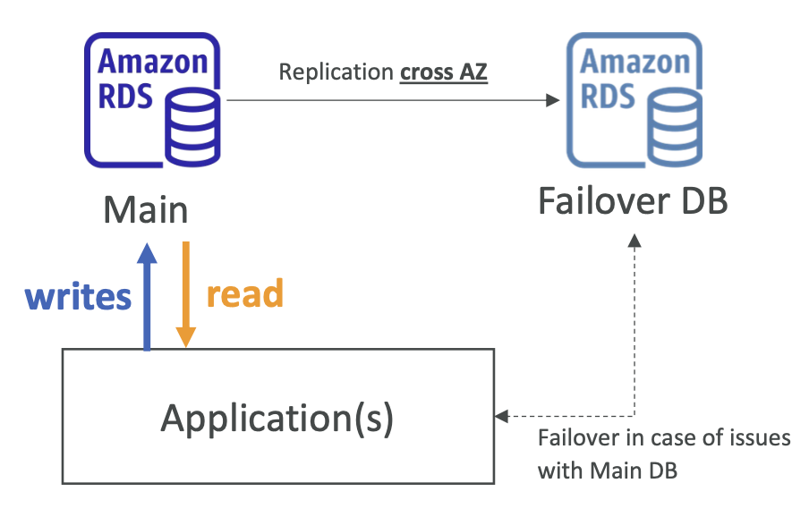
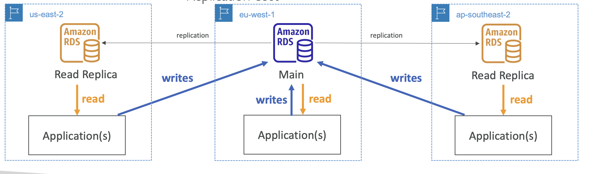

## Databases & Analytics
- You can **structure** the data
- You build **indexes** to efficiently **query / search** through the data
- You define **relationships** between your datasets
- Databases are optimized for a purpose and come with different
features, shapes and constraints

**Relational Databases:**
- databases that are linked

**NoSQL Databases:**
- non relational databases
- Benefits:
  - Flexibility: easy to evolve data model
  - Scalability: designed to scale-out by using distributed clusters • High-performance: optimized for a specific data model
  - Highly functional: types optimized for the data model
- Examples: Key-value, document, graph, in-memory, search databases
- JSON

#### Relational Database Service (RDS)
- managed DB service for DB use **SQL** as a query language
- create databases in the cloud that are managed by AWS 
  - Postgres
  - MySQL
  - MariaDB
  - Oracle
  - Microsoft SQL Server
  - Aurora (AWS Proprietary database)

**RDS versus deploying DB on EC:**

  - PROS:
    - Automated provisioning, OS patching
    - Continuous backups and restore to specific timestamp (Point in Time Restore)! 
    - Monitoring dashboards
    - Read replicas for improved read performance
    - Multi AZ setup for DR (Disaster Recovery)
    - Maintenance windows for upgrades
    - Scaling capability (vertical and horizontal) 
    - Storage backed by EBS (gp2 or io1)

  - CONS:
    - cant SSH

#### Amazon Aurora
- proprietary technology from AWS (not open sourced)
- PostgreSQL and MySQL
- claims 5x performance improvement over MySQL on RDS, over 3x the performance of Postgres on RDS
- costs more than RDS (20% more) – but is more efficient

**Serverless:**
- Automated database instantiation and auto-scaling based on actual usage
- No capacity planning needed
- Least management overhead
- Use cases: 
  - good for infrequent, intermittent or unpredictable workloads

#### Deployments
**Read Replicas:**
- Scale the read workload of your DB
- Can create up to 15 Read Replicas 
- Data is only written to the main DB
- 

**Multi-AZ:**
- Failover in case of AZ outage (high availability) 
- Data is only read/written to the main database 
- Can only have 1 other AZ as failover
- 

**Multi-Region:**
- Disaster recovery in case of region
issue
- Local performance for global reads 
- Replication cost
- 

#### ElastiCache
- managed Redis or Memcached
- Caches are in-memory databases with high performance, low latency
- Helps reduce load off databases for read intensive workloads

#### DynamoDB
- NoSQL database - not a relational database
- key/value database

**DynamoDB Accelerator (DAX):**
- Fully Managed in-memory cache for
DynamoDB
- 10x performance improvement
- DAX is only used for and is integrated with DynamoDB, while ElastiCache can be used for other databases

#### Redshift
- PostgreSQL, but it’s not used for OLTP
- it is OLAP – online analytical processing (analytics and data warehousing)
- Load data once every hour, not every second

**Serverless:**
- Automatically provisions and scales data warehouse underlying capacity
- Run analytics workloads without managing data warehouse infrastructure • Pay only for what you use (save costs)
- Use cases
  - Reporting, dashboarding applications, real-time analytics

#### Elastic MapReduce (EMR)
- helps creating **Hadoop clusters (Big Data)** to analyze and process vast amount of data

#### Athena
- Serverless query service to analyze data stored in Amazon S3
- SQL
- analyze data in S3 using serverless SQL, use Athena

#### QuickSight
- Serverless machine learning-powered business intelligence service to create **interactive dashboards**

#### DocumentDB
- Aurora is an “AWS-implementation” of PostgreSQL / MySQL
- DocumentDB is the same for MongoDB (which is a NoSQL database)

#### Neptune
- Fully managed graph database
- Examples; Wikipedia, social media

#### Quantum Ledger Database (QLDB)
- Used to review history of all the changes made to your application data over time
- Immutable system: no entry can be removed or modified, cryptographically verifiable
- centralization component

#### Managed Blockchain
- decentralization component
- Blockchain makes it possible to build applications where multiple parties can execute transactions without the need for a trusted, central authority.

#### Glue
- Managed extract, transform, and load (ETL) service

#### Database Migration Service (DMS)
- Quickly and securely migrate databases to AWS, resilient, self healing
- The source database remains available during the migration

#### Databases & Analytics - Summary
- Relational Databases - OLTP:
  - RDS & Aurora (SQL)
- Differences between Multi-AZ, Read Replicas, Multi-Region
- In-memory Database: 
  - ElastiCache
- Key/Value Database: 
  - DynamoDB (serverless) & DAX (cache for DynamoDB)
- Warehouse - OLAP: 
  - Redshift (SQL)
- Hadoop Cluster: 
  - EMR
- Athena: 
  - query data on Amazon S3 (serverless & SQL)
- QuickSight: 
  - dashboards on your data (serverless)
- DocumentDB:
  - “Aurora for MongoDB”(JSON – NoSQL database)
- Amazon QLDB:
  - Financial Transactions Ledger(immutable journal, cryptographically verifiable)
- Amazon Managed Blockchain: 
  - managed Hyperledger Fabric & Ethereum blockchains
- Glue: 
  - Managed ETL (Extract Transform Load) and Data Catalog service
- Database Migration: 
  - DMS
- Neptune: 
  - graph database