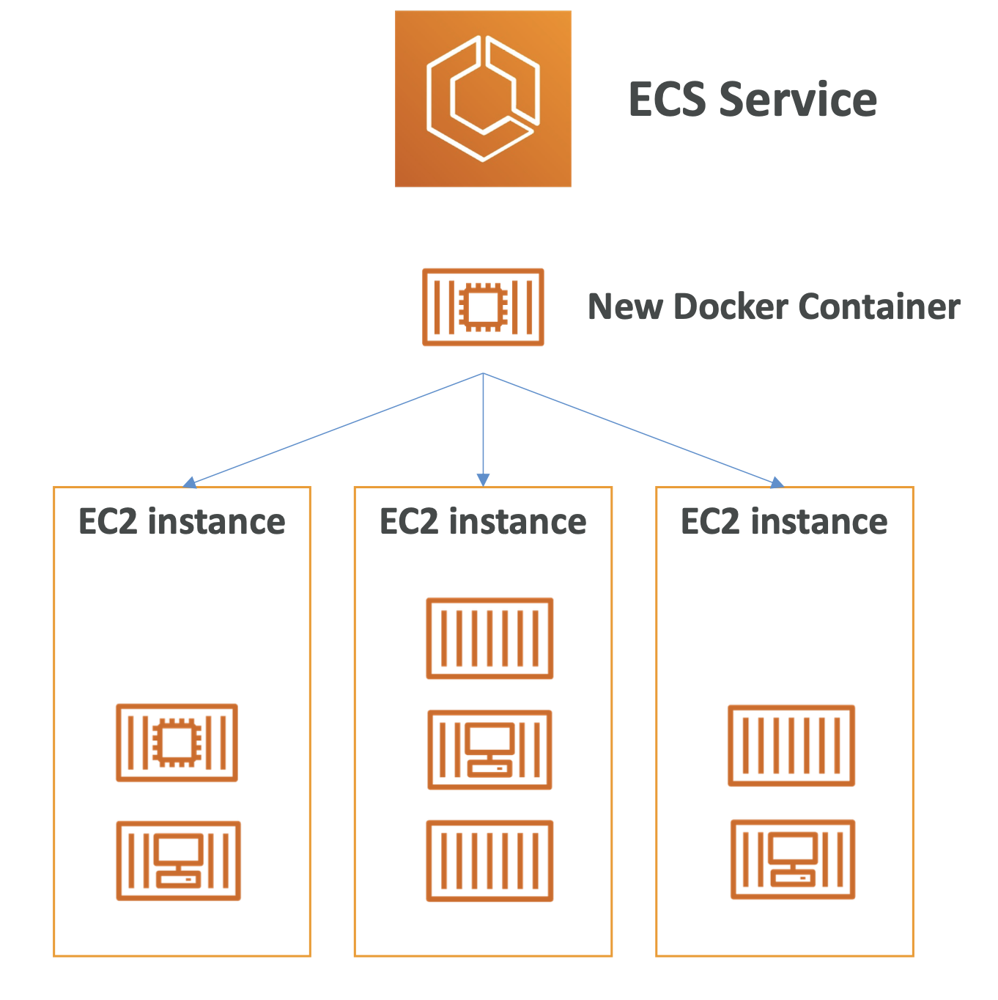
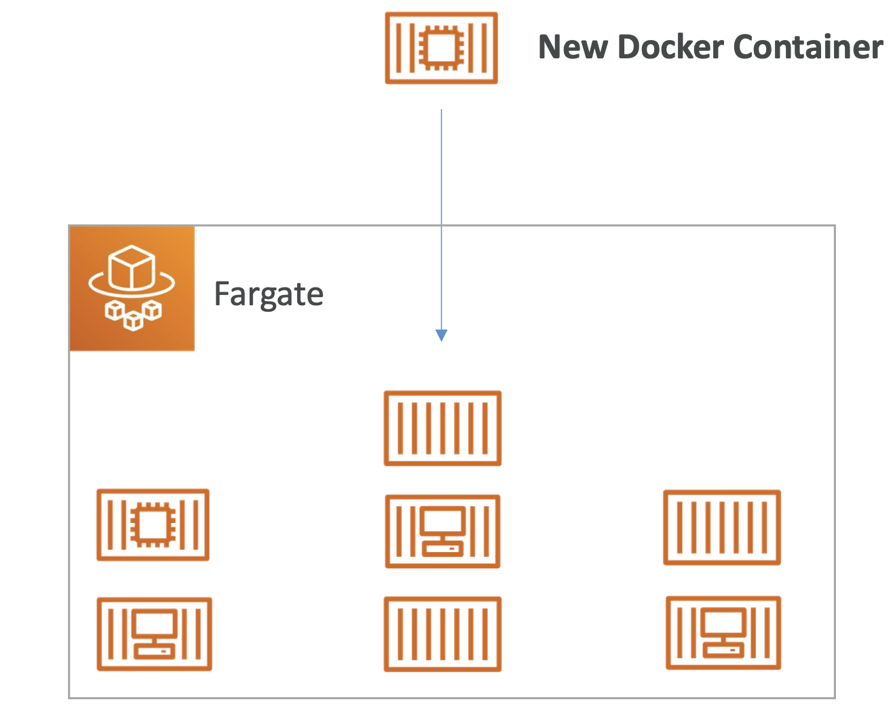
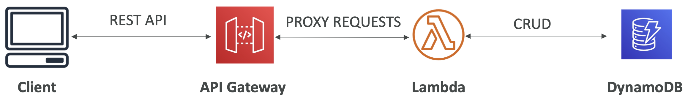
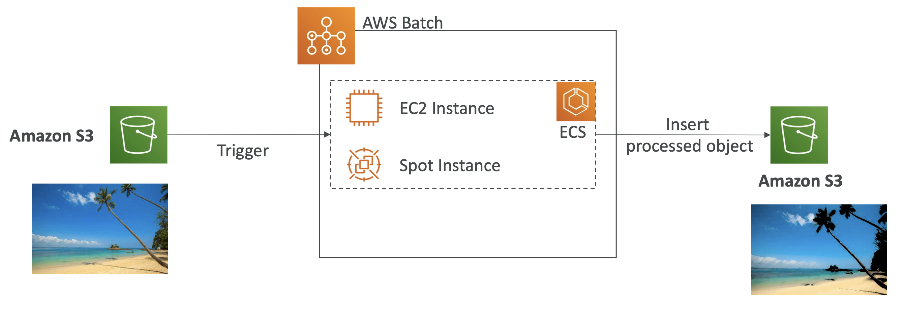

## Other Compute Services

#### Docker
- software development platform to deploy apps
- Apps are packaged in containers that can be run on any OS
- Apps run the same, regardless of where they’re run: 
  - Any machine
  - No compatibility issues
  - Predictable behavior
  - Less work
  - Easier to maintain and deploy
  - Works with any language, any OS, any technology
  - Scale containers up and down very quickly (seconds)

**Docker Images:**
- stored in Docker Repositories
- Public: Docker Hub  
- Private: Amazon ECR (Elastic Container Registry)

**Virtualization:**
- Docker is ”sort of” a virtualization technology, but not exactly
- Resources are shared with the host => many containers on one server

#### Elastic Container Service (ECS)
- Launch Docker containers on AWS
- **You DO provision & maintain the infrastructure** (the EC2 instances)
- 

#### Fargate
- Launch Docker containers on AWS
- **You DO NOT provision & maintain the infrastructure** (the EC2 instances)
- serverless
- 

#### Elastic Container Registry (ECR)
- Private Docker Registry on AWS
- store your Docker images so they can be run by ECS or Fargate

#### Lambda
- Virtual functions – no servers to manage! 
- Limited by time - short executions
- Run on-demand
- Scaling is automated!
- Event-Driven: functions get invoked by AWS when needed
- many programming languages
- Lambda Container Image
  - The container image must implement the Lambda Runtime API 
  - ECS / Fargate is preferred for running arbitrary Docker images
- It is usually very cheap to run AWS Lambda so it’s very popular
- Use cases:
  - Create Thumbnails for images uploaded onto S3 
  - Run a Serverless cron job

#### API Gateway
- if you want to build a serverless API
- Serverless and scalable
- Supports RESTful APIs and WebSocket APIs
- 

#### Batch
- Fully managed batch processing at any scale
- Batch will dynamically launch EC2 instances or Spot Instances
- Batch jobs are defined as Docker images and run on ECS
- 

#### Batch vs Lambda
- Lambda:
  - Time limit
  - Limited runtimes
  - Limited temporary disk space 
  - Serverless

- Batch:
  - No time limit
  - Any runtime as long as it’s packaged as a Docker image
  - Rely on EBS / instance store for disk space
  - Relies on EC2 (can be managed by AWS)

#### Lightsail
- low price
- Simpler alternative to using EC2, RDS, ELB, EBS, Route 53, etc etc
- for noobies with little to no cloud experience
- use case: Simple web applications, web sites

#### Other Compute Services - Summary
- Docker:
  - container technology to run applications
- ECS: 
  - run Docker containers on EC2 instances
- Fargate:
  - Run Docker containers without provisioning the infrastructure 
  - Serverless offering (no EC2 instances)
- ECR: 
  - Private Docker Images Repository
- Batch: 
  - run batch jobs on AWS across managed EC2 instances
- Lightsail: 
  - predictable & low pricing for simple application & DB stacks