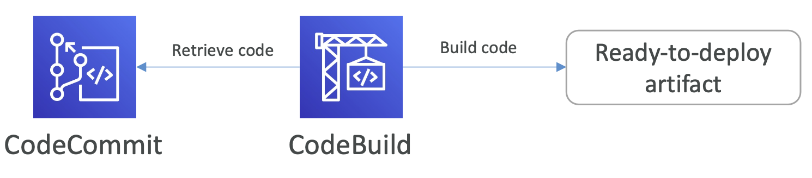

## Deploying and Managing Infrastructure at Scale

#### CloudFormation
- creating your AWS infrastructure in a 'template'
- allows you to creates in the right order, with the exact configuration that you specify
- example template:
  - I want a security group
  - I want two EC2 instances using this security group
  - I want an S3 bucket
  - I want a load balancer (ELB) in front of these machines

**Benefits:**
- Infrastructure as code
- Cost Effective
- Productivity
  - Declarative programming
- Don’t re-invent the wheel
  - use existing templates
- Supports (almost) all AWS resources

#### Cloud Development Kit (CDK)
- Define your cloud infrastructure using a programming language, then it will compile to a CloudFormation template
- meaning y ou can therefore deploy infrastructure and application runtime code together 
  - Great for Lambda functions
  - Great for Docker containers in ECS / EKS

#### Developers using AWS
- Devs using AWS ONLY care about **DEPLOYING AND RUNNING YOUR  CODE**.
- Devs don't care about:
  - Managing infrastructure
  - Configuring all the databases, load balancers, etc 
  - Scaling concerns
- Most web apps have the same architecture (ALB + ASG)

#### Beanstalk
- developer centric view of deploying an application on AWS
- Platform as a Service (PaaS)
- Managed service:
  - Instance configuration / OS is handled by Beanstalk
  - Deployment strategy is configurable but performed by Elastic Beanstalk 
  - Capacity provisioning
  - Load balancing & auto-scaling
  - Application health-monitoring & responsiveness
- Just the application code is the responsibility of the developer
- Example models:
  - Single Instance deployment: good for dev
  - LB + ASG: great for production or pre-production web applications 
  - ASG only: great for non-web apps in production (workers, etc..)

#### CodeDeploy
- We want to upgrade our application automatically
- Works with:
  - ECS 2 instances
  - on prem services
  - hybrid

#### CodeCommit
- AWS' version of GitHub

#### CodeBuild
- Compiles source code, run tests, and produces packages that are ready to be deployed
- 

#### CodePipeline
- CICD (Continuous Integration & Continuous Delivery)
- Fully managed, compatible with CodeCommit, CodeBuild,CodeDeploy, ElasticBeanstalk, CloudFormation, GitHub, 3rd-party services (GitHub...) & custom plugins...
- 

#### CodeArtifact
- Artifacts are software packages depend on each other to be built (also called **code dependencies**)
- Developers and CodeBuild can then retrieve dependencies straight from CodeArtifact

#### CodeStar
- Unified UI to easily manage software development activities in one place

#### Cloud9
- cloud IDE

#### Systems Manager (SSM)
- Hybrid AWS service
- Helps you manage your EC2 and On-Premises systems at scale

**Session Manager:**
- Allows you to start a secure shell on your EC2 and on-premises servers
- No need for SSH or port 22 open

**Parameter Store:**
- Secure storage for configuration and secrets 
- API Keys, passwords, configurations

#### OpsWorks
- if you need **Chef & Puppet** to help you perform server configuration automatically, or repetitive actions

#### Deployment - Summary
- CloudFormation: (AWS only)
  - Infrastructure as Code, works with almost all of AWS resources 
  - Repeat across Regions & Accounts
- Beanstalk: (AWS only)
  - Platform as a Service (PaaS), limited to certain programming languages or Docker 
  - Deploy code consistently with a known architecture: ex, ALB + EC2 + RDS
- CodeDeploy (hybrid): 
  - deploy & upgrade any application onto servers 
- Systems Manager (hybrid): 
  - patch, configure and run commands at scale 
- OpsWorks (hybrid): 
  - managed Chef and Puppet in AWS

#### Developer Services - Summary
- CodeCommit:
  - Store code in private git repository (version controlled) 
- CodeBuild: 
  - Build & test code in AWS
- CodeDeploy: 
  - Deploy code onto servers
- CodePipeline: 
  - Orchestration of pipeline (from code to build to deploy) 
- CodeArtifact: 
  - Store software packages / dependencies on AWS
- CodeStar: 
  - Unified view for allowing developers to do CICD and code
- Cloud9:
  - Cloud IDE (Integrated Development Environment) with collab
- AWS CDK: 
  - Define your cloud infrastructure using a programming language