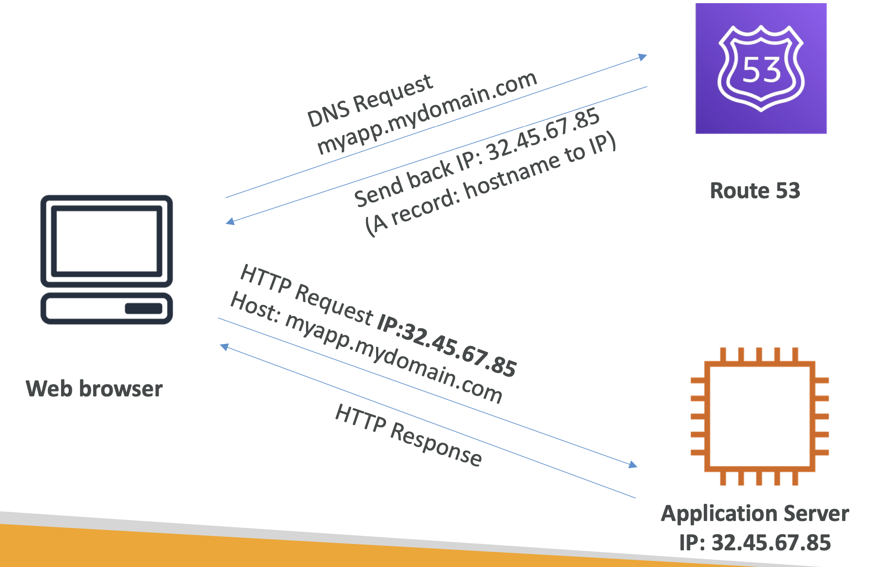
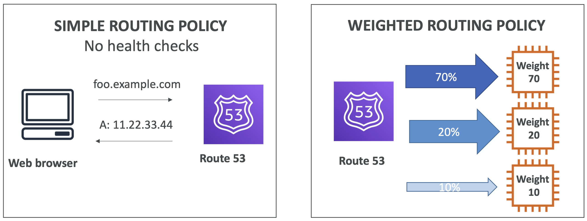
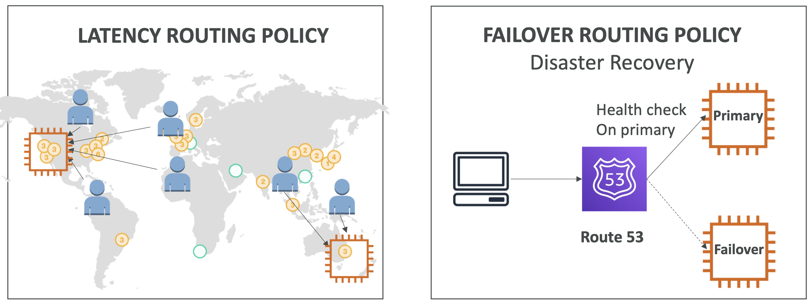
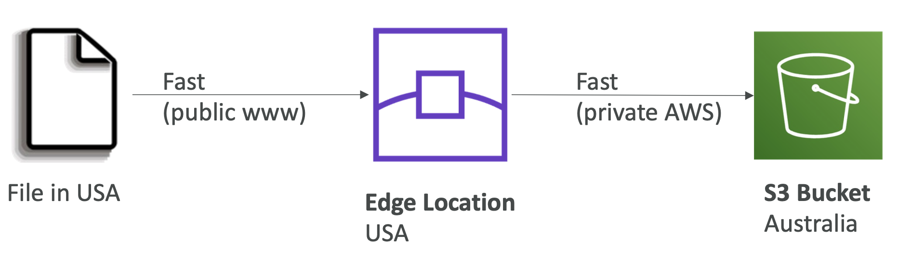
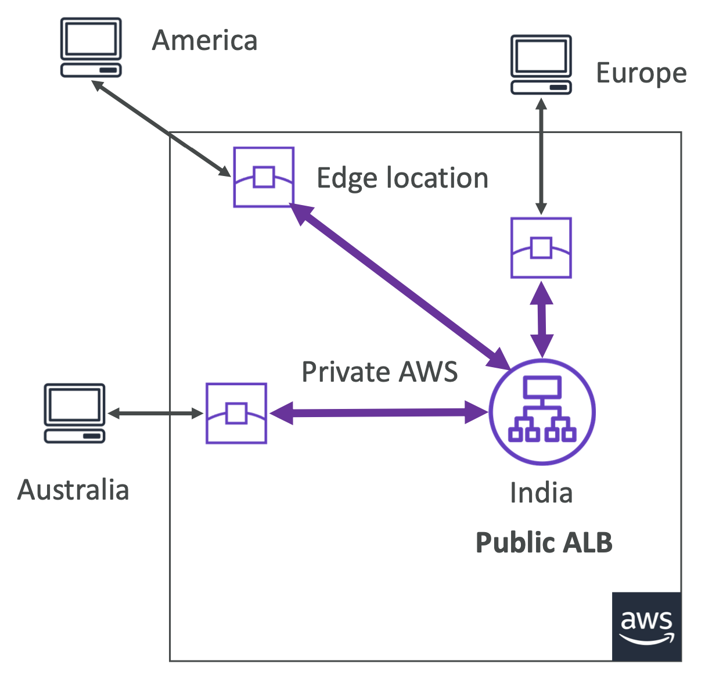
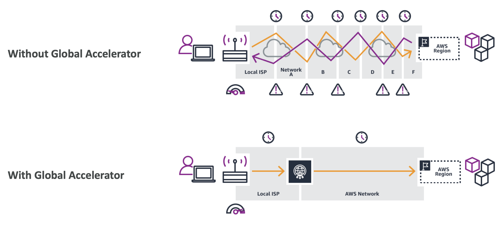
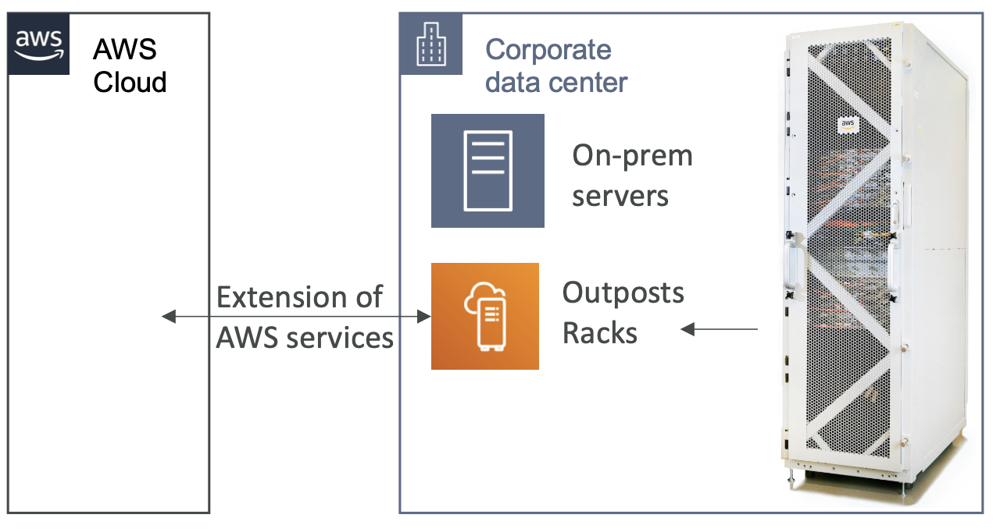
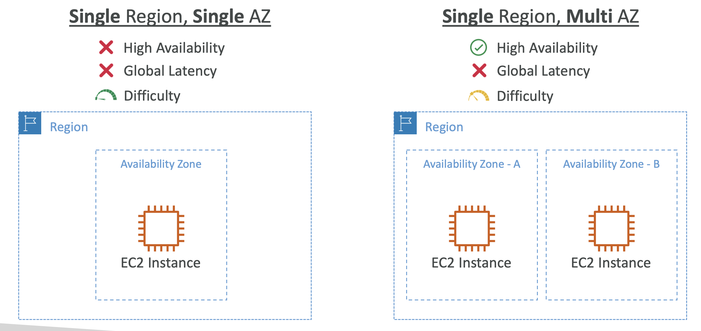
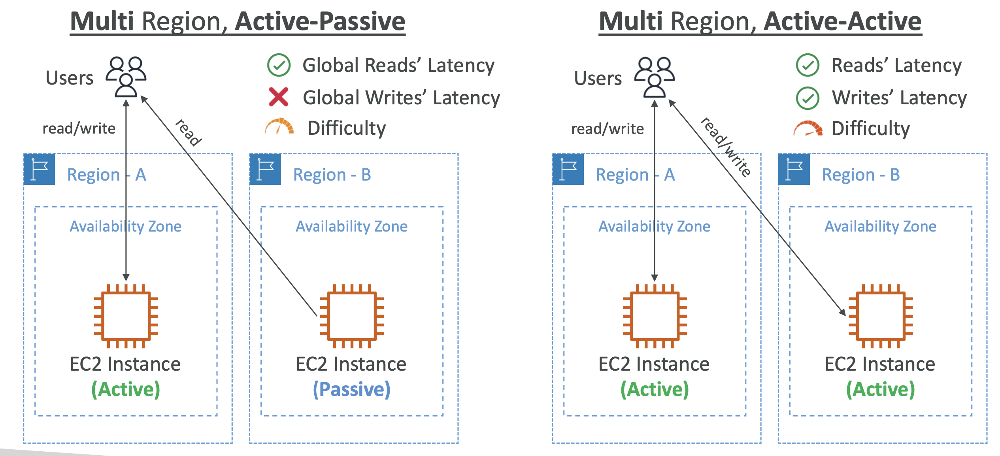

## Global Infrastructure

**Global Application**
- an application deployed in multiple geographies
- Why do we need one?
  - Decreased Latency
  - Disaster Recovery (DR)
  - Attack protection

**Global Applications in AWS:**
- Global DNS: Route 53
- Global Content Delivery Network (CDN): CloudFront
- S3 Transfer Acceleration
- AWS Global Accelerator:

#### Route 53
- Managed DNS (Domain Name System)
- DNS is a collection of rules and records which helps clients understand how to reach a server through URLs.
- 

**Routing Policies:**
- 
- 

#### CloudFront
- Content Delivery Network (CDN)
- Improves read performance, content is cached at the edge
- Improves users experience
- DDoS protection (because worldwide), integration with Shield, AWS Web Application Firewall

**Origins:**
- S3 bucket:
  - For distributing files and caching them at the edge
  - Enhanced security with CloudFront Origin Access Control (OAC)
- Custom Origin (HTTP):
  - Application Load Balancer
  - EC2 instance
  - S3 website
  - Any HTTP backend you want

**CloudFront vs S3 Cross Region Replication:**
- CloudFront:
  - Global Edge network
  - Files are cached for a TTL (maybe a day)
  - **Great for static content that must be available everywhere**
- S3 Cross Region Replication:
  - Must be setup for each region you want replication to happen
  - Files are updated in near real-time
  - Read only
  - **Great for dynamic content that needs to be available at low-latency in few regions**

#### S3 Transfer Acceleration
- Increase transfer speed by transferring file to an AWS edge location which will forward the data to the S3 bucket in the target region
- 

#### Global Accelerator
- Improve global application availability and performance using the AWS global network
- Leverage the AWS internal network to optimize the route to your application (60% improvement)
- Edge locations send the traffic to your application
- 
- 

#### Outposts
- solve the issue of hybrid cloud environments
- Outposts are “server racks”
  - that offers the same AWS infrastructure, services, APIs & tools to build your own applications on-premises just as in the cloud
- AWS will setup and manage “Outposts Racks” within your on-premises infrastructure and you can start leveraging AWS services on-premises
- You are responsible for the Outposts Rack physical security
- 

#### Wavelengths
- Brings AWS services to the edge of the **5G networks**
- Ultra-low latency applications through 5G networks

#### Local Zones
- Places AWS services closer to end users to run latency-sensitive applications
- Example:
  - AWS Region: N.Virginia (us-east-1)
  - AWS Local Zones: Boston, Chicago, Dallas, Houston, Miami, etc.

#### Global Applications Architecture
- 
- 

#### Global Applications in AWS - Summary
- **Global DNS: Route 53:**
  - Great to route users to the closest deployment with least latency 
  - Great for disaster recovery strategies
- **Global Content Delivery Network (CDN): CloudFront**
  - Replicate part of your application to AWS Edge Locations – decrease latency 
  - Cache common requests – improved user experience and decreased latency
- **S3 Transfer Acceleration:**
  - Accelerate global uploads & downloads into Amazon S3
- **AWS Global Accelerator:**
  - Improve global application availability and performance using the AWS global network
- **AWS Outposts:**
  - Deploy Outposts Racks in your own Data Centers to extend AWS services
- **AWS WaveLength:**
  - Brings AWS services to the edge of the 5G networks • Ultra-low latency applications
- **AWS Local Zones:**
  - Bring AWS resources (compute, database, storage, ...) closer to your users 
  - Good for latency-sensitive applications