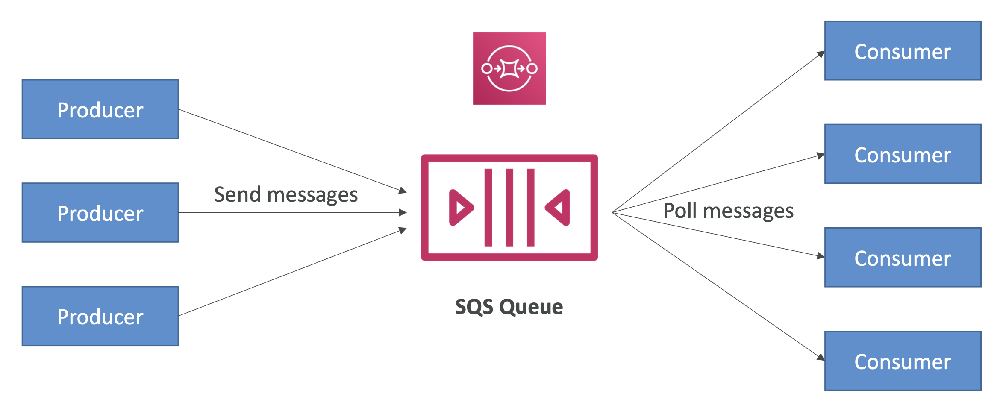
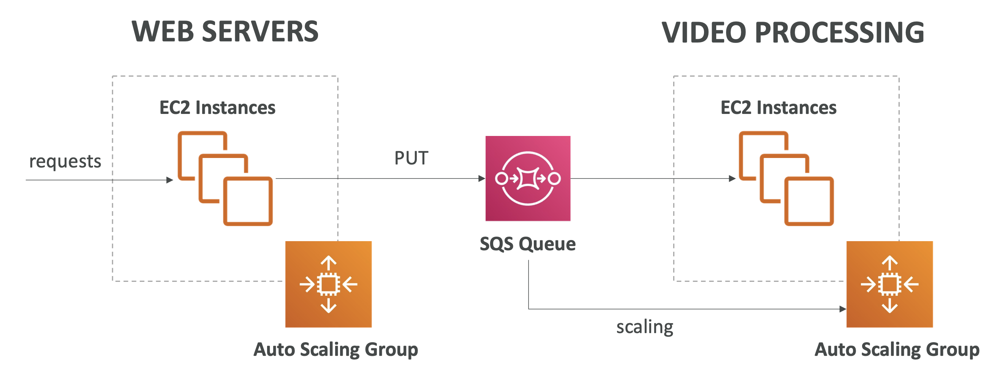
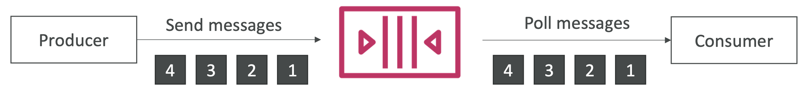
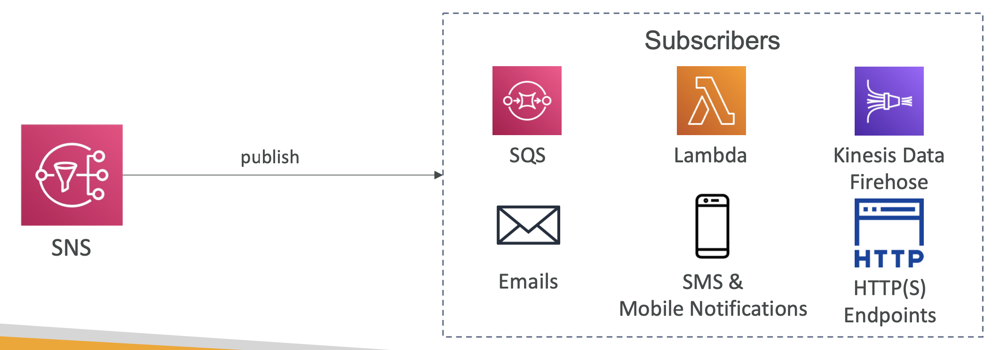

## Cloud Integration

#### Simple Queue Service (SQS)
- What's a queue?
- 

**Standard Queue:**
- Fully managed service (serverless)
- use to **decouple** applications
- Default retention of messages: 4 days, maximum of 14 days
- No limit to how many messages can be in the queue
- Messages are deleted after they’re read by consumers
- Low latency (<10 ms on publish and receive)
- Consumers share the work to read messages & scale horizontally
- 

**FIFO Queue:**
- First In First Out (ordering of messages in the queue)
- Messages are processed in order by the consumer
- 

#### Kinesis
- Kinesis = **real-time big data streaming**
- Managed service to collect, process, and analyze real-time streaming data at any scale

#### Simple Notification Services (SNS)
- “**event publishers**” only sends message to one SNS topic
- “**event subscribers**” as we want to listen to the SNS topic notifications 
- Each subscriber to the topic will get all the messages
- 

#### MQ
- managed message broker service
- When migrating to the cloud, instead of re-engineering the application to use SQS and SNS, we can use Amazon MQ
- on-premises may use open protocols such as:
  - MQTT, AMQP, STOMP, Openwire, WSS
- doesn’t “scale” as much as SQS / SNS

#### Cloud Integration - Summary
**SQS:**
- Queue service in AWS
- Multiple Producers, messages are kept up to 14 days
- Multiple Consumers share the read and delete messages when done 
- Used to **decouple** applications in AWS
- It uses a pull-based system.

**SNS:**
- Notification service in AWS
- Subscribers: Email,Lambda,SQS,HTTP,Mobile...
- Multiple Subscribers, send all messages to all of them - No message retention

**Kinesis:** 
- real-time data streaming, persistence and analysis

**Amazon MQ:**
- managed message broker for ActiveMQ and RabbitMQ in the
cloud (MQTT, AMQP.. protocols)