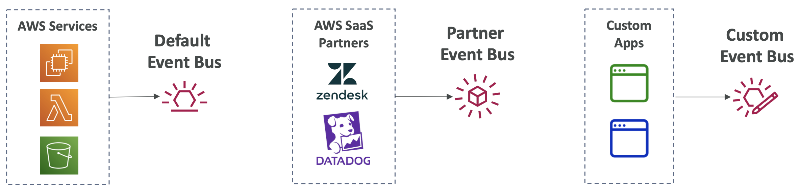
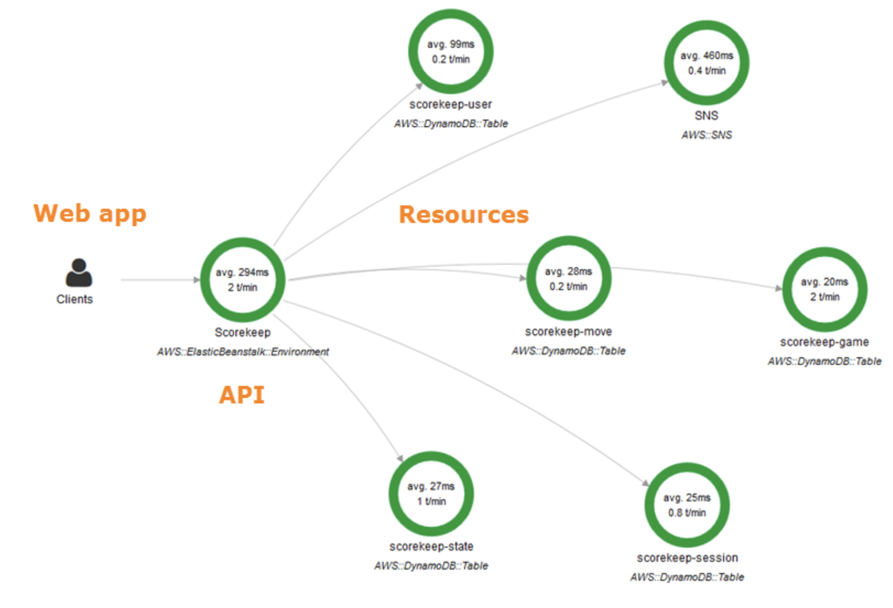

## Cloud Monitoring

#### CloudWatch
- provides metrics for every services in AWS

**Important Metrics:**
- EC2 instances: 
  - CPU Utilization, Status Checks, Network (not RAM) 
  - Default metrics every 5 minutes
  - Option for Detailed Monitoring ($$$): metrics every 1 minute
- EBS volumes: 
  - Disk Read/Writes
- S3 buckets: 
  - BucketSizeBytes, NumberOfObjects, AllRequests 
- Billing: 
  - Total Estimated Charge (only in us-east-1)
- Service Limits: 
  - how much you’ve been using a service API
- Custom metrics: 
  - push your own metrics

**Alarms:**
- used to trigger notifications for any metric
- Example: create a billing alarm on the CloudWatch Billing metric

**Logs:**
- real-time monitoring of logs
- AWS services:
  - Elastic Beanstalk: 
    - collection of logs from application
  - ECS: 
    - collection from containers
  - AWS Lambda: 
    - collection from function logs
  - CloudTrail 
    - based on filter
  - CloudWatch log agents: 
    - on EC2 machines or on-premises servers 
  - Route53: 
    - Log DNS queries

**Logs on EC2:**
- By default, no logs from your EC2 instance will go to CloudWatch
- CloudWatch log agent can be setup on-premises too

#### EventBridge / CloudWatch Events
- react to events on your AWS account
- Schedule:
  - Cron jobs (scheduled scripts)
  - Example:
    - Schedule Every hour -> Trigger script on Lambda function
- Event Pattern: 
  - Event rules to react to a service doing something
  - Example:
    - IAM Root User Sign in Event -> SNS Topic with Email Notification
- can react to events to outside apps or custom
- 

#### CloudTrail
- Provides governance, compliance and audit for your AWS Account
- enabled by default
- Get an history of events / API calls made within your AWS Account:
  - Console
  - SDK
  - CLI
  - AWS Services
- Can put logs from CloudTrail into CloudWatch Logs or S3

#### X-Ray
- Visual analysis of our applications
- Uses cases:
  - Troubleshooting performance (bottlenecks)
  - Understand dependencies in a microservice architecture - Pinpoint service issues
  - Review request behavior
  - Find errors and exceptions
  - Are we meeting time SLA?
  - Where I am throttled?
  - Identify users that are impacted
- 

#### CodeGuru
- An ML-powered service for **automated code reviews and application performance recommendations**
- CodeGuru Reviewer: 
  - automated code reviews for static code analysis (development)
- CodeGuru Profiler: 
  - visibility/recommendations about application performance during runtime (production)
- 

**CodeGuru Reviewer:**
- Identify critical issues, security vulnerabilities, and hard-to-find bugs
- Example: 
  - common coding best practices, resource leaks, security detection, input validation

**CodeGuru Profiler:**
- Helps understand the runtime behavior of your application
- Example: 
  - identify if your application is consuming excessive CPU capacity on a logging routine
- Features:
  - Identify and remove code inefficiencies
  - Improve application performance (e.g.,reduceCPU utilization)
  - Decrease compute costs
  - Provides heap summary (identify which objects using
  up memory)
  - Anomaly Detection
- Support applications running on AWS or on- premise

#### Health Dashboard
**Service History:**
- Shows all regions, all services health
- Shows historical information for each day
- Has an RSS feed you can subscribe to

**Your Account:**
- alerts and remediation guidance when AWS is experiencing events that may impact you.
- gives you a personalized view into the performance and availability of the AWS services underlying your AWS resources

#### Cloud Monitoring - Summary
- CloudWatch:
  - Metrics: monitor the performance of AWS services and billing metrics
  - Alarms: automate notification, perform EC2 action, notify to SNS based on metric
  - Logs: collect log files from EC2 instances, servers,Lambda unctions...
- Events (or EventBridge): 
  - react to events in AWS, or trigger a rule on a schedule
- CloudTrail: 
  - audit API calls made within your AWS account
- CloudTrail Insights: 
  - automated analysis of your CloudTrail Events
- X-Ray: 
  - trace requests made through your distributed applications
- Amazon CodeGuru: 
  - automated code reviews and application performance recommendations
- AWS Health Dashboard: 
  - status of all AWS services across all regions
- AWS Account Health Dashboard: 
  - AWS events that impact your infrastructure