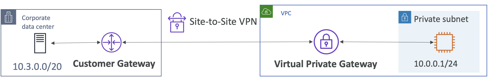
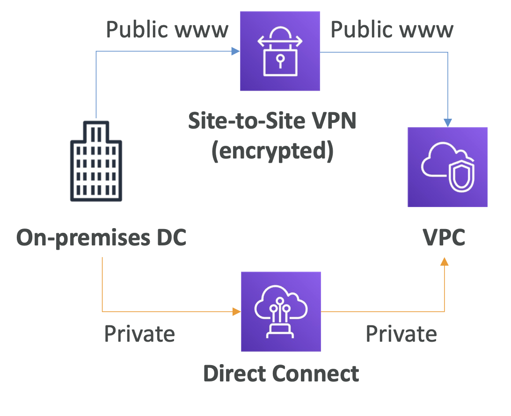
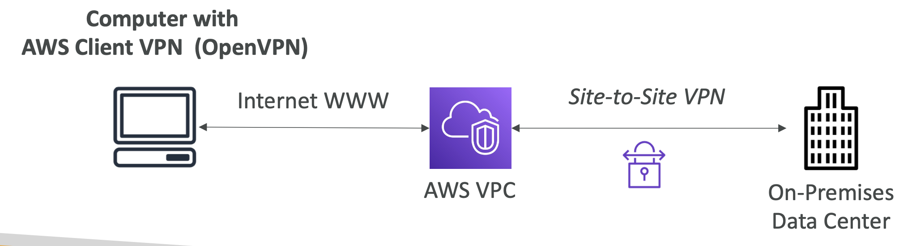
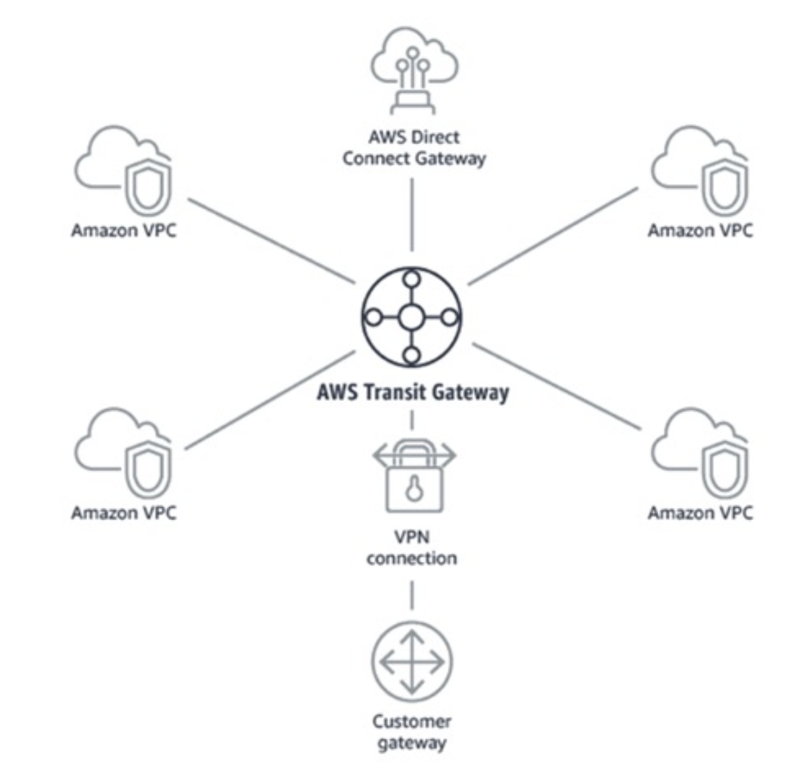

## VPC & Networking

#### VPC
- virtual private cloud

#### Site to Site VPN
- Connect an on-premises VPN to AWS
- The connection is automatically encrypted
- Goes over the **public internet**
- On-premises:
  - must use a **Customer Gateway (CGW)**
- AWS:
  - must use a **Virtual Private Gateway (VGW)**
- 

#### Direct Connect
- Establish a physical connection between on-premises and AWS
- The connection is private, secure and fast
- Goes over a **private network**
- Takes at least a month to establish

#### Client VPN
- Connect from your computer using OpenVPN to your private network in AWS and on-premises
- Allow you to connect to your EC2 instances over a private IP (just as if you were in the private VPC network)
- Goes over **public Internet**
- 

#### Transit Gateway
- One single Gateway to provide this functionality
- 

#### VPC & Networking - Summary
- VPC: 
  - Virtual Private Cloud
- Subnets: 
  - Tied to an AZ,network partition of the VPC
- Internet Gateway: 
  - at the VPC level, provide Internet Access
- NAT Gateway / Instances: 
  - give internet access to private subnets
- NACL: 
  - Stateless, subnet rules for inbound and outbound
- Security Groups: 
  - Stateful, operate at the EC2 instance level or ENI
- VPC Peering: 
  - Connect two VPC with non overlapping IP ranges, nontransitive
- Elastic IP: 
  - fixed public IPv4, ongoing cost if not in-use
- VPC Endpoints: 
  - Provide private access to AWS Services within VPC
- PrivateLink:
  - Privately connect to a service in a 3rd partyVPC
- VPC Flow Logs: 
  - network traffic logs
- Site to Site VPN: 
  - VPN over public internet between on-premises DC and AWS:
- Client VPN:
  - OpenVPN connection from your computer into your VPC
- Direct Connect: 
  - direct private connection to AWS
- Transit Gateway: 
  - Connect thousands ofVPC and on-premises networks together