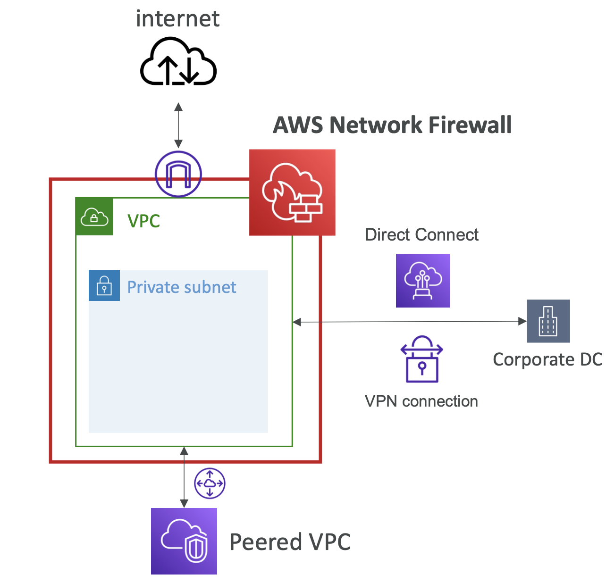
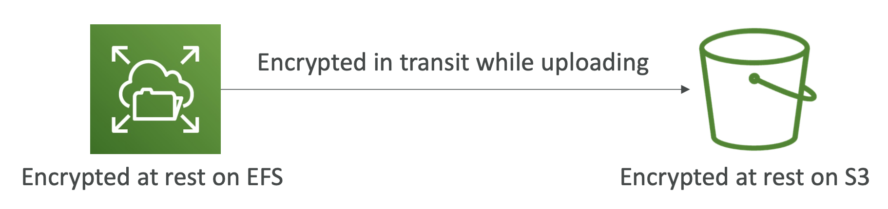
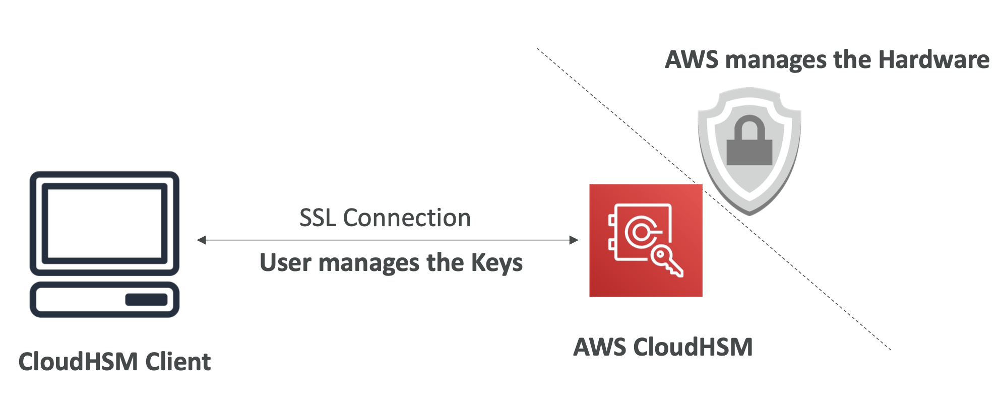
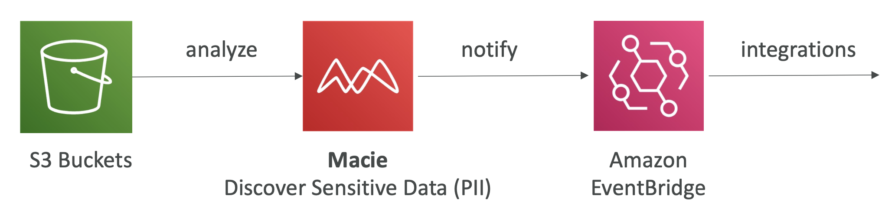
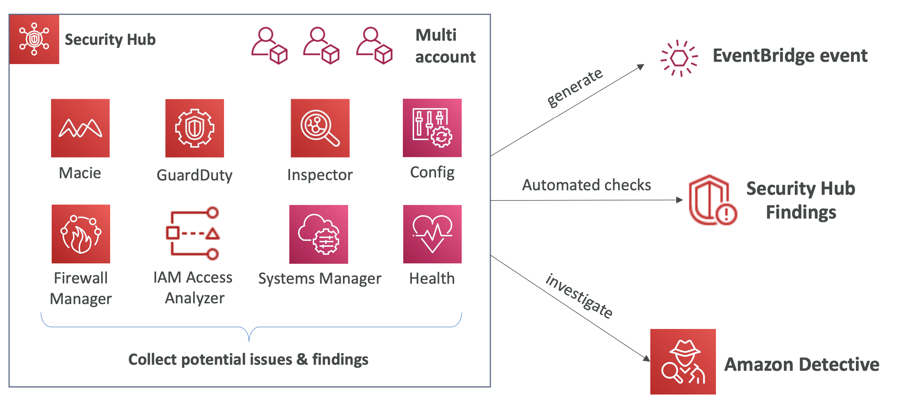

## Security & Compliance

#### DDoS Attack
- Distributed Denial-of-Service
- basically a user have multiple master servers launching multiple bots trying to connect to our server, thus crashing our server app.

#### DDOS Protection on AWS
- AWS Shield Standard: 
  - protects against DDOS attack for your website and applications, for all customers at no additional costs
- AWS Shield Advanced: 
  - 24/7 premium DDoS protection
- AWS WAF: 
  - Filter specific requests based on rules
- CloudFront and Route 53:
    - Availability protection using global edge network
    - Combined with AWS Shield, provides attack mitigation at the edge
- Be ready to scale – leverage AWS Auto Scaling

#### Shield

**Shield Standard:**
- Free service that is activated for every AWS customer
- Provides protection from attacks such as SYN/UDP Floods, Reflection attacks and other layer 3/layer 4 attack

**Shield Advanced:**
- Optional DDoS mitigation service ($3,000 per month per organization)
- Protect against more sophisticated attack on Amazon EC2, Elastic Load Balancing (ELB), Amazon CloudFront, AWS Global Accelerator, and Route 53
- 24/7 access to AWS DDoS response team (DRP)
- Protect against higher fees during usage spikes due to DDoS

#### Web Application Firewall (WAF)
- Protects your web applications from common web exploits (Layer 7) 
- **Layer 7 is HTTP** (vs Layer 4 is TCP)
- Deploy on **Application Load Balancer, API Gateway, CloudFront**
- Define Web ACL (Web Access Control List):
  - Rules can include **IP addresses**, HTTP headers, HTTP body, or URI strings
  - Protects from common attack - **SQL injection and Cross-Site Scripting (XSS)**
  - Size constraints, **geo-match (block countries)**
  - **Rate-based rules** (to count occurrences of events) – for **DDoS protection**

#### Network Firewall
- Protect your entire Amazon VPC
- From Layer 3 to Layer 7 protection
- Any direction, you can inspect:
  - VPC to VPC traffic
  - Outbound to internet
  - Inbound from internet
  - To / from Direct Connect & Site- to-Site VPN
- 

#### Penetration Testing
- means when you attack your own app to test it's security
- without prior approval for 8 services:
  - Amazon EC2 instances, NAT Gateways, and Elastic Load Balancers 
  - Amazon RDS
  - Amazon CloudFront
  - Amazon Aurora
  - Amazon API Gateways
  - AWS Lambda and Lambda Edge functions 
  - Amazon Lightsail resources
  - Amazon Elastic Beanstalk environments
- Prohibited Activities (basically anything that looks like an attack to AWS themselves):
  - DNS zone walking via Amazon Route 53 Hosted Zones
  - Denial of Service (DoS), Distributed Denial of Service (DDoS), Simulated DoS, Simulated DDoS
  - Port flooding
  - Protocol flooding
  - Request flooding (login request flooding, API request flooding)

#### Encryption
- Data At rest:
  - data stored or archived on a device
  - Example: On a hard disk, on a RDS instance, in S3 Glacier Deep Archive, etc.
- Data In transit (in motion):
  - data being moved from one location to another 
  - Example: Transfer from on-premises to AWS, EC2 to DynamoDB, etc.
- For this we leverage encryption keys
- 

#### Key Management Service (KMS)
- Anytime you hear **“encryption” for an AWS service, it’s most likely KMS**
- KMS -> AWS manages the encryption keys for us
- Encryption Opt-in:
  - EBS volumes: encrypt volumes
  - S3 buckets: Server-side encryption of objects 
  - Redshift database: encryption of data
  - RDS database: encryption of data
  - EFS drives: encryption of data
- Encryption Automatically enabled:
  - CloudTrail Logs
  - S3 Glacier
  - Storage Gateway

#### CloudHSM
- physical hardware device
- CloudHSM -> AWS provisions encryption hardware
- Dedicated Hardware (HSM = Hardware Security Module)
- You manage your own encryption keys entirely (not AWS)
- HSM device is tamper resistant, FIPS 140-2 Level 3 compliance
- 

#### Types of KMS Keys
- Customer Managed Key:
  - Create, manage and used by the customer, can enable or disable
  - Possibility of rotation policy (new key generated every year, old key preserved) 
  - Possibility to bring-your-own-key
- AWS Managed Key:
  - Created, managed and used on the customer’s behalf by AWS 
  - Used by AWS services (aws/s3,aws/ebs,aws/redshift)
- AWS Owned Key:
  - Collection of CMKs that an AWS service owns and manages to use in multiple accounts 
  - AWS can use those to protect resources in your account (but you can’t view the keys)
- CloudHSM Keys (custom keystore):
  - Keys generated from your own CloudHSM hardware device
  - Cryptographic operations are performed within the CloudHSM cluster

#### Certificate Manager (Amazon CM)
- Let’s you easily provision, manage, and deploy
**SSL/TLS Certificates**
- Used to provide in-flight encryption for websites (HTTPS)
- Supports both public and privateTLS certificates
- Free of charge for publicTLS certificates
- AutomaticTLS certificate renewal
- Integrations with (loadTLS certificates on): 
  - Elastic Load Balancers
  - CloudFront Distributions
  - APIs on API Gateway

#### Secrets Manager
- Newer service, meant for storing secrets
- Capability to **force rotation of secrets** every X days
- Automate generation of secrets on rotation (uses Lambda)
- Integration with **Amazon RDS** (MySQL, PostgreSQL, Aurora) 
- Secrets are encrypted using KMS
- Mostly meant for RDS integration

#### Artifacts
- compliance documents

#### GuardDuty
- Intelligent Threat discover y to protect your AWS Account
- Uses Machine Learning algorithms, anomaly detection, 3rd party data
- Input data includes:
  - CloudTrail Events Logs – unusual API calls, unauthorized deployments
    - CloudTrailManagementEvents – create VPC subnet,create trail,... 
    - CloudTrailS3DataEvents – get object,list objects,delete object,...
  - VPC Flow Logs – unusual internal traffic, unusual IP address
  - DNS Logs – compromised EC2 instances sending encoded data within DNS queries 
  - Optional Features – EKS Audit Logs, RDS & Aurora, EBS, Lambda, S3 Data Events...
- Can setup EventBridge rules to be notified in case of findings
- EventBridge rules can target AWS Lambda or SNS
- Can protect against CryptoCurrency attacks (has a dedicated “finding” for it)

#### Inspector
- Automated Security Assessments
- only for EC2 instances, Container Images & Lambda functions
- Continuous scanning of the infrastructure, only when needed
- Package vulnerabilities (EC2, ECR & Lambda) – database of CVE
- Network reachability (EC2)
- A risk score is associated with all vulnerabilities for prioritization

#### Config
- Helps with **auditing and recording compliance of your AWS resources** 
- Helps **record configurations and changes over time**
- receive alerts (SNS notifications) for any changes
- per-region service
- NOT FREE

#### Macie
- fully managed data security and data privacy service that uses **machine learning and pattern matching to discover and protect your sensitive data in AWS.**
- helps **identify and alert you to sensitive data, such as personally identifiable information (PII)**
- 

#### Security Hub
- **Central security tool** to manage security across several AWS accounts and automate security checks
- Automatically aggregates alerts to **one central dashboard** from various AWS services & AWS partner tools such as Config, GuardDuty, Macie, etc. etc.
- 

#### Detective
- If you need to find the root issue, then you need a service more in depth than GuardDuty, Macie or Security Hub. You need Detective.
- Detective **analyzes, investigates, and quickly identifies the root cause of security issues or suspicious activities (using ML and graphs)**

#### Abuse
- Report suspected AWS resources used for abusive or illegal purposes to AWS Abuse team
- Examples:
  - Spam
  - Port scanning
  - DoS or DDoS attacks
  - Intrusion attempts 
  - Hosting objectionable or copyrighted content 
  - Distributing malware

#### Root User Privileges Reminders
- Root user = Account Owner
- Has complete access to all AWS services and resources
- Lock away your AWS account root user access keys!
- Do not use the root account for everyday tasks, even administrative tasks

#### IAM Access Analyzer
- To Find out which resources are shared externally by any external apps.
- You can setup a Zone of Trust which is an AWS Account or AWS Organization alias
- Any access outside Zone of Trusts are going to be reported as findings

#### Security & Compliance - Summary
- Shared Responsibility on AWS
- Shield: 
  - Automatic DDoS Protection + 24/7 support for advanced
- WAF: 
  - Firewall to filter incoming requests based on rules
- KMS: 
  - Encryption keys managed by AWS
- CloudHSM: 
  - Hardware encryption, we manage encryption keys
- AWS Certificate Manager: 
  - provision, manage, and deploy SSL/TLS Certificates
- Artifact: 
  - Get access to compliance reports such as PCI, ISO, etc...
- GuardDuty: 
  - Find malicious behavior with VPC, DNS & CloudTrail Logs
- Inspector : 
  - find software vulnerabilities in EC2, ECR Images, and Lambda functions
- Network Firewall: 
  - Protect VPC against network attacks
- Config: 
  - Track config changes and compliance against rules
- Macie: 
  - Find sensitive data (ex: PII data) in Amazon S3 buckets
- CloudTrail:
  - Track API calls made by users within account
- AWS Security Hub: 
  - gather security findings from multiple AWS accounts
- Amazon Detective: 
    - find the root cause of security issues or suspicious activities
- AWS Abuse: 
  - Report AWS resources used for abusive or illegal purposes
- Root user privileges
- IAM Access Analyzer: 
  - identify which resources are shared externally