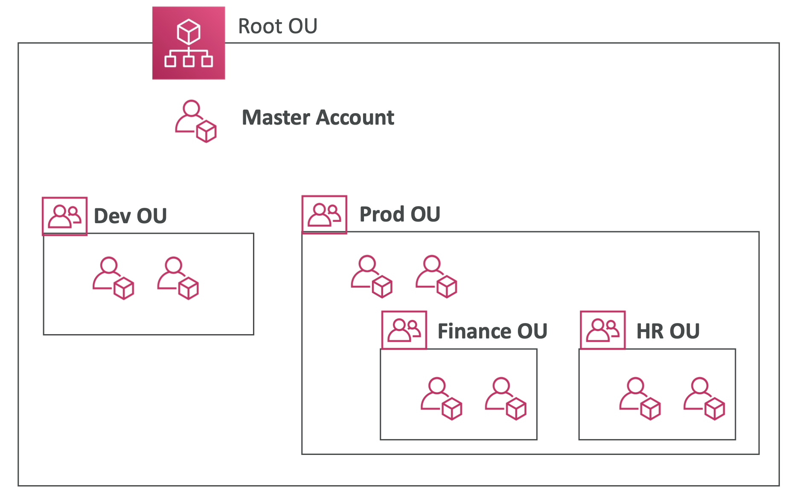
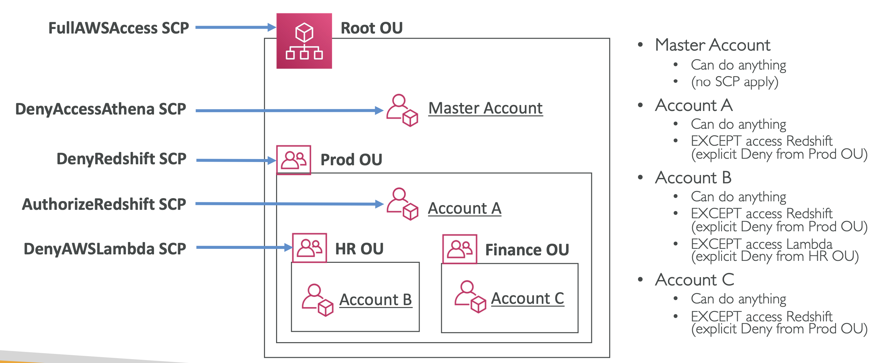
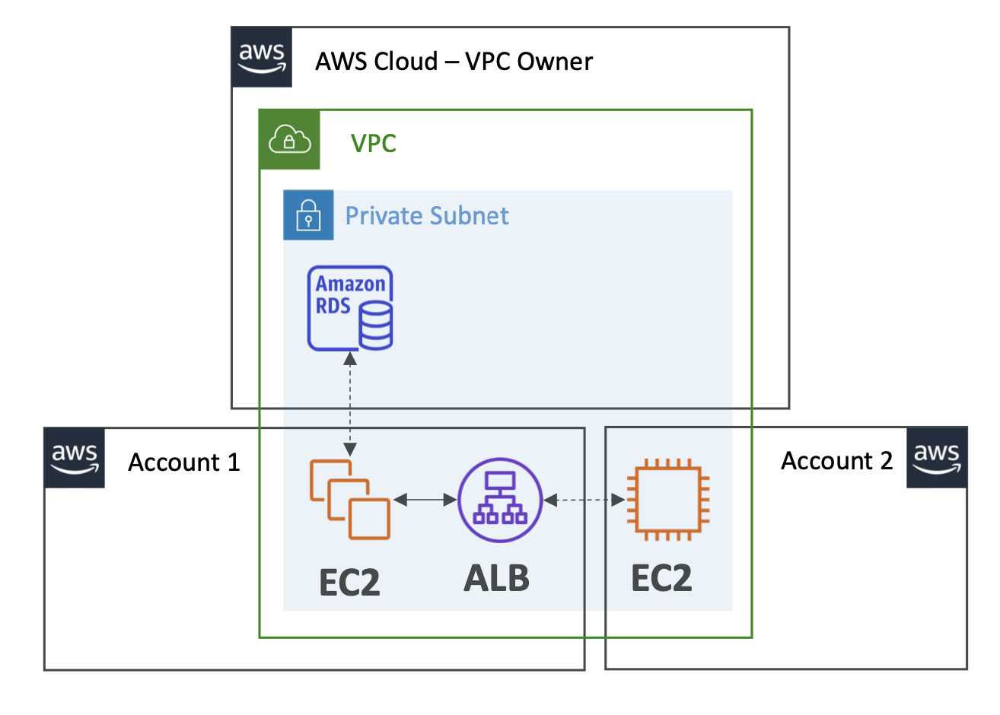
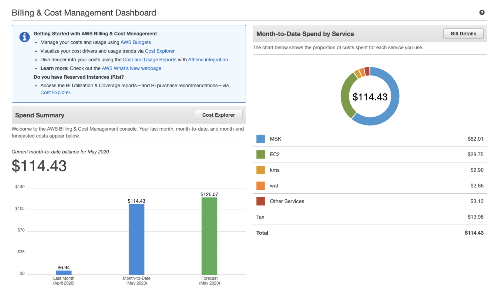
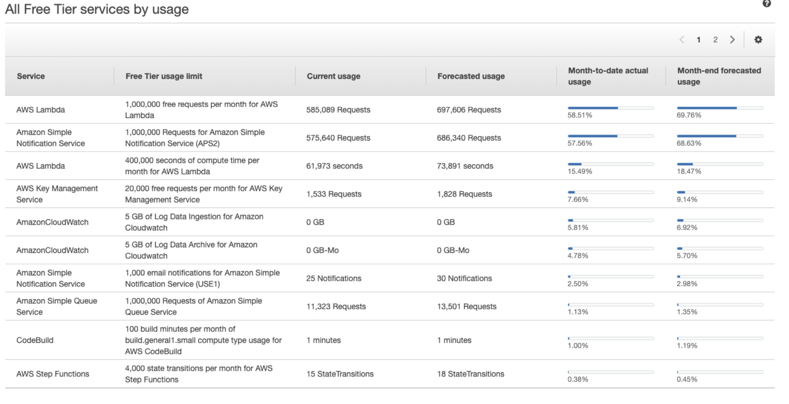
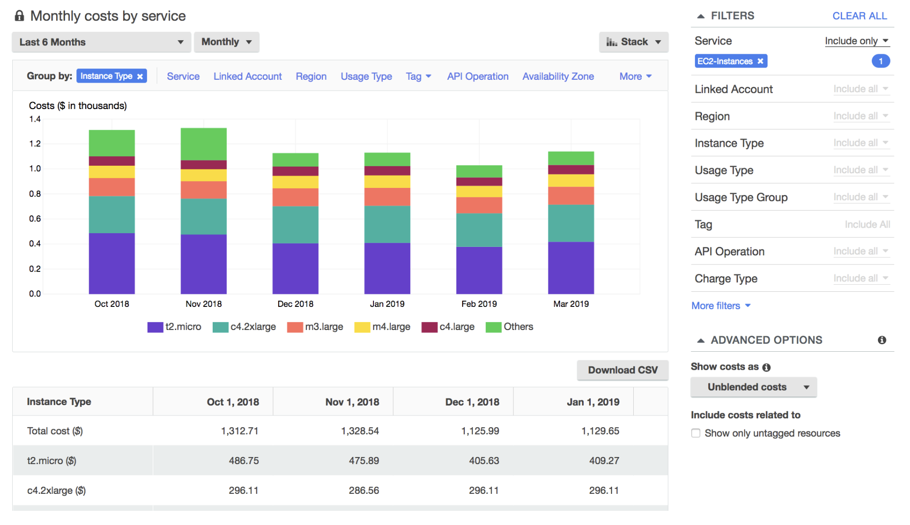
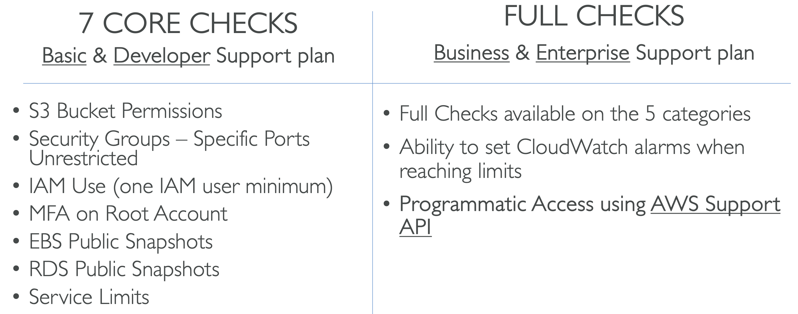
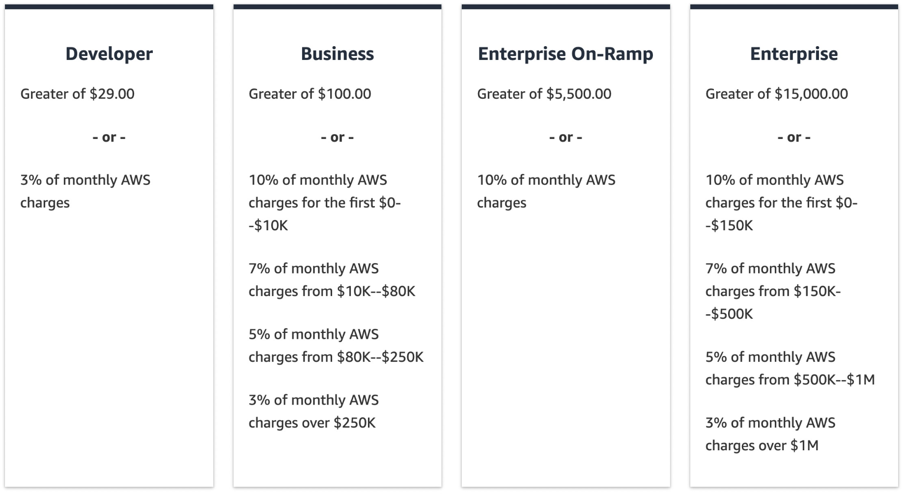

## Account Management, Billing & Support

#### Organizations
- Global service
- Allows to manage **multiple AWS accounts**
- Cost Benefits:
  - **Consolidated Billing** across all accounts - single payment method
  - Pricing benefits from **aggregated usage** (volume discount for EC2, S3...) 
  - **Pooling of Reserved EC2 instances** for optimal savings
- API is available to **automate AWS account creation**
- Restrict account privileges using **Service Control Policies (SCP)**

**Multi Account Strategies:**
- Create different accounts per department, enviroment, user, etc etc using SCP to seperate access levels

**Consolidated Billing:**
- Combined Usage:
  - combine the usage across all AWS accounts in the AWS Organization to share the volume pricing, Reserved Instances and Savings Plans discounts
- One Bill:
  - get one bill for all AWS Accounts in the AWS Organization

#### Service Control Policies (SCP)
- Whitelist or blacklist IAM actions
- Applied at the **OU or Account** level
- Does not apply to the Master Account
- SCP is applied to all the **Users and Roles** of the Account, including Root user
- The SCP does not affect service-linked roles
- SCP must have an explicit Allow (does not allow anything by default)
- Use cases:
  - Restrict access to certain services (for example: can’t use EMR) 
  - Enforce PCI compliance by explicitly disabling services
- 

#### Control Tower
- Easy way to set up and govern a secure and compliant multi-account AWS environment based on best practices
- Control Tower runs on top of AWS Organizations
- Benefits:
  - Automate the set up of your environment in a few clicks
  - Automate ongoing policy management using guardrails 
  - Detect policy violations and remediate them
  - Monitor compliance through an interactive dashboard

#### Resource Access Manager (RAM)
- Share AWS resources that you own with other AWS accounts
- Share with any account or within your Organization
- Avoid resource duplication!
- 

#### Service Catalog
- For users who are overwhelmed with the 100s of AWS services.
- Quick self-service portal to launch a set of authorized products pre-defined by admins

#### Pricing Models in AWS

- Pay as you go: 
  - pay for what you use, remain agile, responsive, meet scale demands
- Save when you reserve: 
  - minimize risks, predictably manage budgets, comply with long-terms requirements
  - Reservations are available for EC2 Reserved Instances, DynamoDB Reserved Capacity, ElastiCache Reserved Nodes, RDS Reserved Instance, Redshift Reserved Nodes
- Pay less by using more: 
  - volume-based discounts
- Pay less as AWS grows

#### Compute Pricing

**EC2:**
- Only charged for what you use
- On-demand instances: 
  - Minimum of 60s
  - Pay per second (Linux/Windows) or per hour (other)
- Reserved instances:
  - Up to 75% discount compared to On-demand on hourly rate
  - 1- or 3-years commitment
  - All upfront, partial upfront, no upfront
- Spot instances:
  - Up to 90% discount compared to On-demand on hourly rate 
  - Bid for unused capacity
- Dedicated Host: 
  - On-demand
  - Reservation for 1 year or 3 years commitment
- Savings plans as an alternative to save on sustained usage

**Lambda:**
- Pay per call
- Pay per duration

**ECS:**
- EC2 Launch Type Model: 
  - No additional fees, you pay for AWS resources stored and created in your application

**Fargate:**
- Fargate Launch Type Model: 
  - Pay for vCPU and memory resources allocated to your applications in your containers

#### Storage Pricing

**S3:**
- **Storage class:** S3 Standard, S3 Infrequent Access, S3 One-Zone IA, S3 Intelligent Tiering, S3 Glacier and S3 Glacier Deep Archive
- Pay if you use any of the following:
  - for the number and size of objects - Price can be tiered (based on volume)
    - more volume, more discounts you get
  - the number and type of requests
  - for any data transferred OUT of S3
  - if you use S3 Transfer Acceleration
  - Lifecycle transitions
- Similar service: EFS (pay per use, has infrequent access & lifecycle rules)

**EBS:**
- You pay:
  - volume type
  - size of the volume (doesn't matter if you use it or not)
  - IOPS:
    - General Purpose SSD: Included
    - Provisioned IOPS SSD: Provisioned amount in IOPS 
    - Magnetic: Number of requests
  - Snapshots:
    - Added data cost per GB per month
  - Data transfer:
    - Outbound data transfer are tiered for volume discounts
    - Inbound is free

**RDS:**
- You pay:
  - per hour
  - The database:
    - database characteristics:
      - Engine
      - Size
      - Memory class
    - Purchase type: 
      - On-demand
      - Reserved instances (1 or 3 years) with required up-front
    - Backup Storage: There is no additional charge for backup storage up to 100% of your total database storage for a region.
  - RDS service:
    - Additional storage (per GB per month)
    - Number of input and output requests per month
    - Deployment type (storage and I/O are variable): 
      - Single AZ
      - Multiple AZs
    - Data transfer:
      - Outbound data transfer are tiered for volume discounts 
      - Inbound is free

**CloudFront:**
- Pricing is different across different geographic regions
- Aggregated for each edge location, then applied to your bill
- Data Transfer Out (volume discount)
- Number of HTTP/HTTPS requests
- Save more by:
  - Use Private IP instead of Public IP for good savings and better network performance
  - Use same AZ for maximum savings (at the cost of high availability)

#### Savings Plan
- **Commit a certain $amount** per hour for 1 or 3 years
- Easiest way to setup long-term commitments on AWS

**EC2 Savings Plan:**
- Up to 72% discount compared to On-Demand
- **Commit to usage of individual instance families in a region **(e.g. C5 or M5) 
- Regardless of AZ, size (m5.xl to m5.4xl), OS (Linux/Windows) or tenancy
- All upfront, partial upfront, no upfront

**Compute Savings Plan:**
- Up to 66% discount compared to On-Demand
- **Regardless of Family, Region, size, OS, tenancy, compute options** 
- Compute Options: EC2, Fargate, Lambda

**Machine Learning Savings Plan:**
- SageMaker

**Compute Optimizer:**
- Reduce costs and improve performance by recommending optimal AWS resources for your workloads
- Uses Machine Learning to analyze your resources’ configurations and their utilization CloudWatch metrics

#### Billing and Costing Tools
- Estimating costs in the cloud: 
  - Pricing Calculator
- Tracking costs in the cloud: 
  - Billing Dashboard
  - Cost Allocation Tags
  - Cost and Usage Reports 
  - Cost Explorer
- Monitoring against costs plans:
  - Billing Alarms
  - Budgets

**Pricing Calculator:**
- Estimate the cost for your solution architecture

**Billing Dashboard:**
- 

**Free Tier Dashboard:**
- 

**Cost Allocation Tags:**
- Use cost allocation tags to track your AWS costs on a detailed level
- Tags are used for organizing resources:
  - EC2: instances, images, load balancers, security groups...
  - RDS,VPC resources, Route 53, IAM users, etc...
  - Resources created by CloudFormation are all tagged the same way
- Example tag names: Name, Environment,Team ...
- Tags can be used to create Resource Groups
  - Create, maintain, and view a collection of resources that share common tags
  - Manage these tags using the Tag Editor

**Cost and Usage Reports:**
- The AWS Cost & Usage Report contains **the most comprehensive set of AWS cost and usage data available**, including additional metadata about AWS services, pricing, and reservations (e.g., Amazon EC2 Reserved Instances (RIs)).
- The AWS Cost & Usage Report lists AWS usage for each service category used by an account and its IAM users in hourly or daily line items, as well as any tags that you have activated for cost allocation purposes.

**Cost Explorer:**
- Visualize, understand, and manage your AWS costs and usage over time
- Analyze your data at a high level: total costs and usage across all accounts
- Choose an optimal Savings Plan (to lower prices on your bill)
- Forecast usage up to 12 months based on previous usage
- 
- 

**Billing Alarms:**
- Billing data metric is stored in CloudWatch us-east-1
- Billing data are for overall worldwide AWS costs
- It’s for actual cost, not for projected costs
- simple alarm, not as complex as AWS Budgets

**Budgets:**
- Create budget and send alarms when costs exceeds the budget
- 4 types of budgets: 
  - Usage, Cost, Reservation, Savings Plans

#### Cost Anomaly Detection
- Continuously monitor your cost and usage using ML to detect unusual spends
- It learns your unique, historic spend patterns to detect one-time cost spike and/or continuous cost increases (you don’t need to define thresholds)

#### Service Quotas
- Notify you when you’re close to a service quota value threshold
- Create CloudWatch Alarms on the Service Quotas console

#### Trusted Advisor
- high level AWS account assessment
- Analyze your AWS accounts and provides recommendation on 5 categories:
  - Cost optimization
  - Performance
  - Security
  - Fault tolerance
  - Service limits
- 

#### Support Plans

**Basic Plan:**
- FREE
- Customer Service & Communities 
  - 24x7 access to customer service, documentation, whitepapers, and support forums.
- AWS Trusted Advisor 
  - Access to the 7 core Trusted Advisor checks and guidance to provision your resources following best practices to increase performance and improve security.
- AWS Personal Health Dashboard 
  - A personalized view of the health of AWS services, and alerts when your resources are impacted.

**Developer Plan:**
- Everything in Basic Plan
- Business hours email access to **Cloud Support Associates** 
- Unlimited cases / 1 primary contact
- Case severity / response times:
  - General guidance: < 24 business hours 
  - System impaired: < 12 business hours

**Business Plan:**
- Intended to be used if you have **production workloads**
- Trusted Advisor – Full set of checks + API access
- 24x7 phone, email, and chat access to **Cloud Support Engineers** 
- Unlimited cases / unlimited contacts
- Access to Infrastructure Event Management for additional fee.
- Case severity / response times:
  - General guidance: < 24 business hours
  - System impaired: < 12 business hours
  - Production system impaired: < 4 hours • Production system down: < 1 hour

**Enterprise On-Ramp Plan:**
- Everything in Business Plan
- Intended to be used if you have **production or business critical workloads**
- Access to a **pool of Technical Account Managers (TAM)**
- **Concierge Support Team **(for billing and account best practices)
- **Infrastructure Event Management, Well-Architected & Operations Reviews**
- Case severity / response times:
  - Production system impaired: < 4 hours
  - Production system down: < 1 hour
  - **Business-critical system down: < 30 minutes**

**Enterprise Plan:**
- Everything in Business Plan
- Intended to be used if you have **mission critical workloads**
- Access to a **designated Technical Account Managers (TAM)**
- **Concierge Support Team **(for billing and account best practices)
- **Infrastructure Event Management, Well-Architected & Operations Reviews**
- Case severity / response times:
  - Production system impaired: < 4 hours
  - Production system down: < 1 hour
  - **Business-critical system down: < 15 minutes**

#### Account Best Practices – Summary
- Operate multiple accounts using **Organizations**
- Use **SCP** (service control policies) to restrict account power
- Easily setup multiple accounts with best-practices with **AWS Control Tower**
- Use **Tags & Cost Allocation Tags** for easy management & billing
- **IAM guidelines**: MFA, least-privilege, password policy,password rotation
- **Config** to record all resources configurations & compliance over time
- **CloudFormation** to deploy stacks across accounts and regions
- **Trusted Advisor** to get insights, Support Plan adapted to your needs
- Send Service Logs and Access Logs to **S3 or CloudWatch Logs**
- **CloudTrail** to record API calls made within your account
- **If your Account is compromised**: change the root password, delete and rotate all passwords / keys, contact the AWS support
- Allow users to create pre-defined stacks defined by admins using **AWS Service Catalog**

#### Billing and Costing Tools – Summary

- Compute Optimizer: 
  - recommends resources’ configurations to reduce cost 
- Pricing Calculator: 
  - cost of services on AWS
- Billing Dashboard: 
  - high level overview + free tier dashboard
- Cost Allocation Tags: 
  - tag resources to create detailed reports
- Cost and Usage Reports: 
  - most comprehensive billing dataset
- Cost Explorer: 
  - view current usage (detailed) and forecast usage
- Billing Alarms: 
  - in us-east-1 – track overall and per-service billing
- Budgets: 
  - more advanced – track usage, costs, RI, and get alerts
- Savings Plans: 
  - easy way to save based on long-term usage of AWS
- Cost Anomaly Detection: 
  - detect unusual spends using Machine Learning
- Service Quotas: 
  - notify you when you’re close to service quota threshold