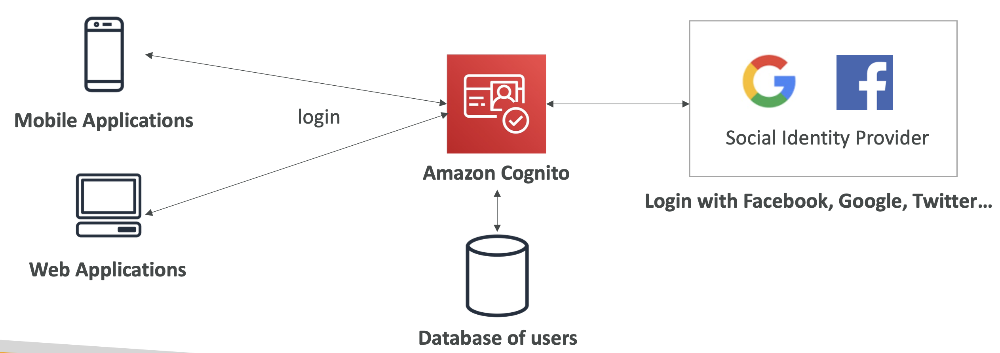

## Advanced Identity

#### Security Token Service (STS)
- Enables you to create temporary, limited- privileges credentials to access your AWS resources
- Short-term credentials: you configure expiration period

#### Cognito
- Identity for your Web and Mobile applications users (potentially millions) 
- Instead of creating them an IAM user, you create a user in Cognito
- 

#### Directory Services
- Active Directory

#### IAM Identity Center
- successor to AWS Single Sign-On
- One login (single sign-on) for all your AWS accounts in AWS Organizations, etc etc

#### Advanced Identity - Summary
- IAM
  - Identity and Access Management inside your AWS account 
  - For users that you trust and belong to your company
- Organizations: 
  - Manage multiple accounts
- Security Token Service (STS): 
  - temporary, limited-privileges credentials to access AWS resources
- Cognito: 
  - create a database of users for your mobile & web applications
- Directory Services: 
  - integrate Microsoft Active Directory in AWS
- IAM Identity Center: 
  - one login for multiple AWS accounts & applications
