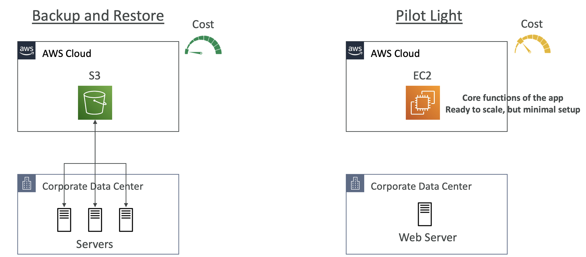
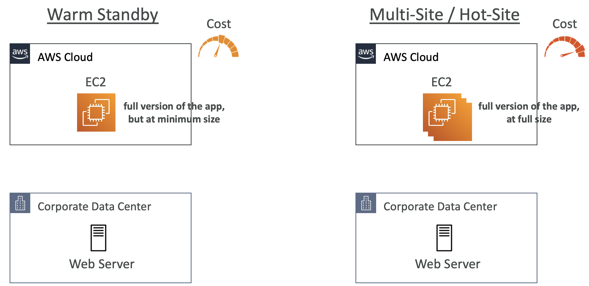
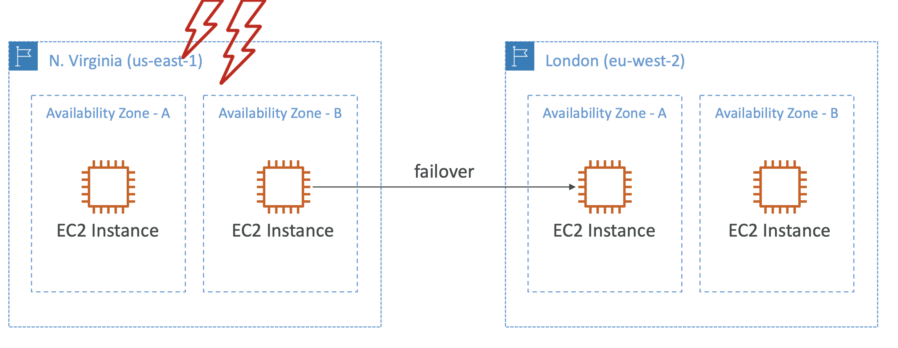
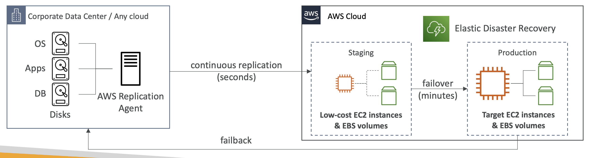
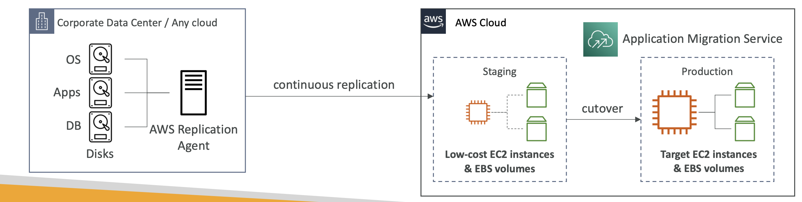
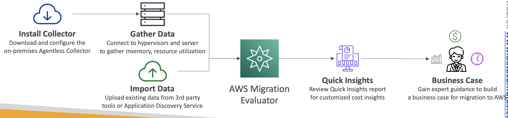
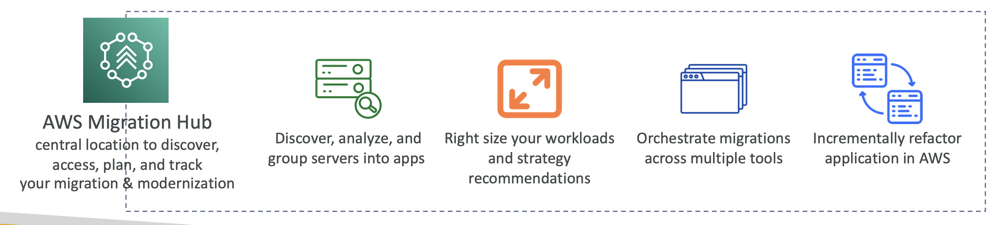

## Other Services

#### Workspaces
- Managed Desktop as a Service (DaaS) solution to easily provision Windows or Linux desktops
- Fully managed VDI and desktop available
- Workspaces are on-demand or always on

#### AppStream 2.0
- Desktop Application Streaming Service
- delivered from within a web browser
- Stream a desktop application to web browsers (no need to connect to a VDI)
- Works with any device (that has a web browser)
- Allow to configure an instance type per application type (CPU, RAM, GPU)

#### IoT Core
- IoT stands for “Internet of Things”:
  - the network of internet-connected devices that are able to collect and transfer data
- IoT Core allows you to easily connect IoT devices to the AWS Cloud
- Serverless, secure & scalable

#### Elastic Transcoder
- used to convert media files stored in S3 into media files in the formats required by consumer playback devices (phones etc..)

#### AppSync
- Store and sync data across mobile and web apps in real-time
- Makes use of GraphQL

#### Amplify
- A set of tools and services that helps you develop and deploy scalable full stack web and mobile applications
- example it may contain: Authentication, Storage, API (REST, GraphQL), CI/CD, PubSub, Analytics, etc. etc.
- **it is like Elastic Beanstalk but for web and mobile applications**

#### Application Composer
- Visually design and build serverless applications quickly on AWS
- Interactive drag & drop to deploy AWS infrastructure without being an expert.
- generates IaaC using CloudFormation
- can use existing CloudFormation templates

#### Device Farm
- Fully-managed service that tests your web and mobile apps against desktop browsers, real mobile devices, and tablets
- Run tests concurrently on multiple devices (speed up execution)
- Ability to configure device settings (GPS, language, Wi-Fi, Bluetooth, ...)

#### Backup
- Fully-managed service to centrally manage and automate backups across AWS services
- On-demand and scheduled backups
- Supports PITR (Point-in-time Recovery)
- Retention Periods, Lifecycle Management, Backup Policies, ...
- Cross-Region Backup
- Cross-Account Backup (using AWS Organizations)

#### Disaster Recovery Strategies
- 
- 
- Typical DR Setup for Cloud Deployments
  - 

##### Elastic Disaster Recovery (DRS)
- Used to be named “CloudEndure Disaster Recovery”
- **Quickly and easily recover your physical, virtual, and cloud-based servers into AWS**
- Example: protect your most critical databases (including Oracle, MySQL, and SQL Server), enterprise apps (SAP), protect your data from ransomware attacks, ...
- Continuous block-level replication for your servers
- 

#### DataSync
- Move large amount of data from on-premises to AWS
- Can synchronize to: Amazon S3 (any storage classes – including Glacier), Amazon EFS, Amazon FSx for Windows
- Replication tasks can be scheduled hourly, daily, weekly
- The replication tasks are incremental after the first full load

#### Application Discovery Service
- Plan migration projects by gathering information about on-premises data centers
- Agentless Discovery (AWS Agentless Discovery Connector)
  - VM inventory,configuration, and performance history such as CPU,memory,and disk usage 
- Agent-based Discovery (AWS Application Discovery Agent)
  - System configuration, system performance, running processes, and details of the network connections between systems

#### Application Migration Service (MGN)
- The “AWS evolution” of CloudEndure Migration, replacing AWS Server Migration Service (SMS)
- **Lift-and-shift (rehost) solution which simplify migrating applications to AWS**
- Converts your physical, virtual, and cloud-based servers to run natively on AWS 
- Supports wide range of platforms, Operating Systems, and databases
- Minimal downtime, reduced costs
- 

#### Migration Evaluator
- Helps you build a data-driven business case for migration to AWS
- Provides a clear baseline of what your organization is running today
- 

#### Migration Hub
- Central location to collect servers and applications inventory data for the assessment, planning, and tracking of migrations to AWS
- Helps accelerate your migration to AWS, automate lift-and-shift
- **AWS Migration Hub Orchestrator** 
  - provides pre-built templates to save time and effort migrating enterprise apps (e.g., SAP, Microsoft SQL Server...)
- Supports migrations status updates from **Application Migration Service (MGN) and Database Migration Service (DMS)**
- 

#### Fault Injection Simulator (FIS)
- A fully managed service for running fault injection experiments on AWS workloads
- Based on Chaos Engineering 
  - stressing an application by creating disruptive events (e.g., sudden increase in CPU or memory), observing how the system responds, and implementing improvements
- Helps you uncover hidden bugs and performance bottlenecks

#### Step Functions
- Build serverless visual workflow to orchestrate your Lambda functions

#### Ground Station
- Fully managed service that lets you control satellite communications, process data, and scale your satellite operations
- Provides a global network of satellite ground stations near AWS regions
- Allows you to download satellite data to your AWS VPC within seconds
- Send satellite data to S3 or EC2 instance
- Use cases: 
  - weather forecasting, surface
imaging, communications, video broadcasts

#### Pinpoint
- Scalable 2-way (outbound/inbound) marketing communication
- Supports email, SMS, push, voice, etc. etc.
- Use cases: 
  - run campaigns by sending marketing, bulk, transactional SMS messages
- Versus Amazon SNS or Amazon SES
  - In SNS & SES:
    - you managed each message's audience, content, and delivery schedule
  - In Amazon Pinpoint:
    - you create message templates, delivery schedules, highly-targeted segments, and full campaigns
