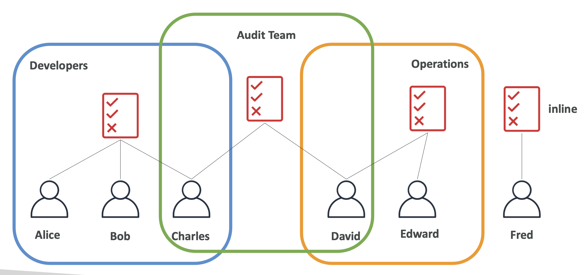
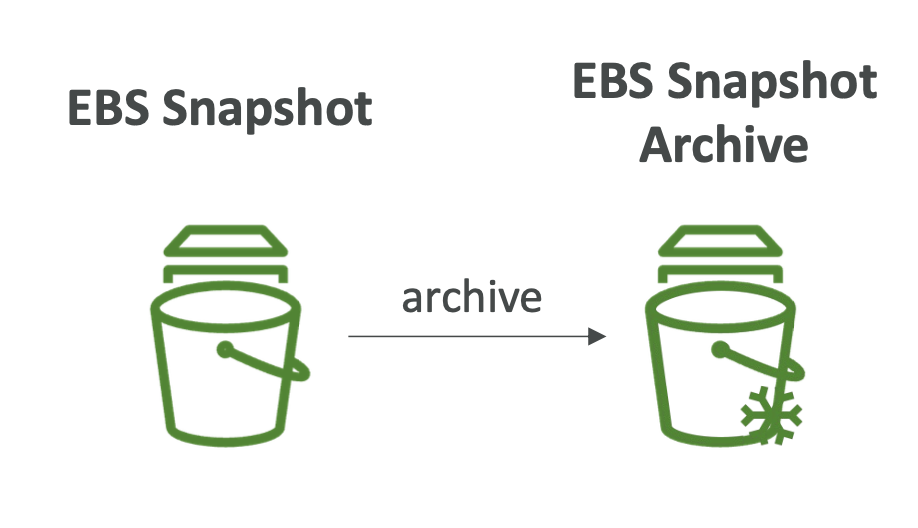
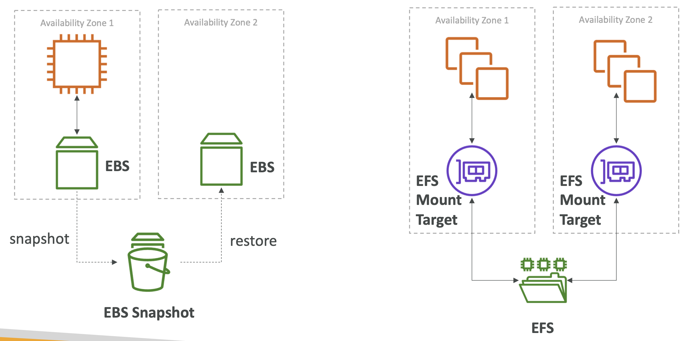
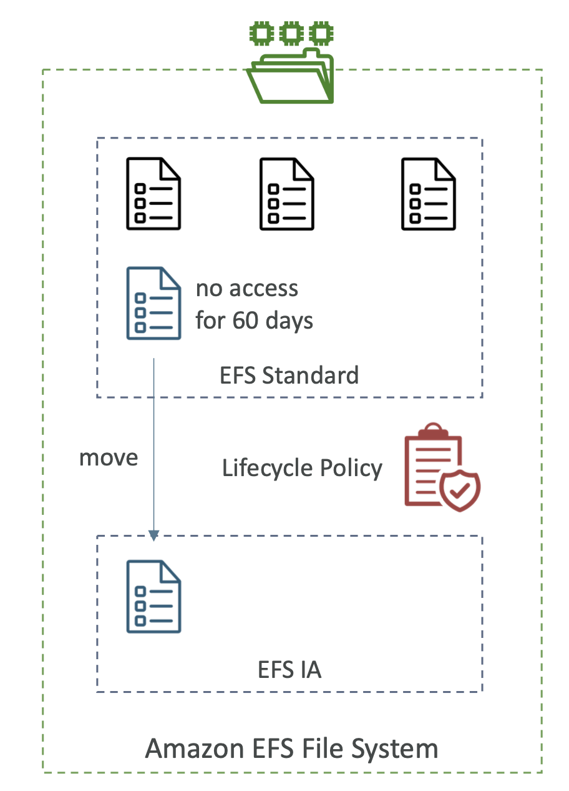

# Certified Cloud Pracitioner
Resources used:  
1. https://www.udemy.com/course/aws-certified-cloud-practitioner-new/

---

## Cloud Computing Basics
Cloud computing is the on-demand delivery of compute power database storage, applications, and other IT resources.

- Through a cloud services platform with **pay-as-you-go pricing**
- You can **provision exactly the right type and size of computing resources** you need
- You can access as many resources as you need, almost **instantly**
- Simple way to access **servers, storage, databases and a set of application services**

#### Private Cloud:
- Cloud services used by a single organization, not exposed to the public.
- Complete control
- Security for sensitive applications
- Meet specific business needs

#### Public Cloud:
- Cloud resources owned and operated by a third- party cloud service provider delivered over the Internet.
- Six Advantages of Cloud Computing

#### Hybrid Cloud:
- Keep some servers on premises and extend some capabilities to the Cloud
- Control over sensitive assets in your private infrastructure
- Flexibility and cost- effectiveness of the public cloud

#### Five Characteristics of Cloud Computing:
1. On-demand self service:
2. Broad network access:
3. Multi-tenancy and resource pooling:
4. Rapid elasticity and scalability:
5. Measured service

#### Six Advantages of Cloud Computing:
1. Trade capital expense (CAPEX) for operational expense (OPEX) 
    - Pay On-Demand: don’t own hardware
    - ReducedTotal Cost of Ownership (TCO) & Operational Expense (OPEX)
2. Benefit from massive economies of scale
3. Stop guessing capacity
4. Increase speed and agility
5. Stop spending money running and maintaining data centers 
6. Go global in minutes

#### Problems solved by the Cloud:
- Flexibility
- Cost-Effectiveness
- Scalability
- Elasticity
- High Availability and fault tolerance

#### Types of Cloud Computing:
- 

#### 3 Pricing of the Cloud:
- AWS follows pay-as-you-go principle
    - Compute
      - Pay for compute time
    - Storage
      - Pay for data storage in the Cloud
    - Data
      - Pay for data transfer **OUT NOT IN** in Cloud. (*IN IS FREE*)

---

## AWS Infrastructure

#### Consists of:
- Regions
- Availability Zones (AZ)
- Data Centers
- Edge Locations / Point of Presence

#### Choose AWS Regions by:
- **Compliance** with data governance and legal requirements
- **Proximity** to customers
- **Available** services within a Region
- **Pricing**

#### Availability Zones (AZ):
- region has multiple AZs
- each AZ 
  - has one or more discrete data centers
  - separate from each other to isolate disasters
  - high bandwidth, ultra-low latency networking

#### Points of Presence (Edge Locations):
- Content is delivered to end users with lower latency

#### Shared Responsibility Model:
- 

---

## Identity Access Management (IAM)

#### Users & Groups:
- global service
- users are people
- groups only contain people, not other groups

#### Permissions:
- Users or Groups can be assigned **JSON documents called policies**
- In AWS you apply the **least privilege principle**: don’t give more permissions than a user needs

#### Policies:
- 

#### MFA:
- MFA = password you know + security device you own
- Example: phone app, physical hardware MFA device

#### Access Keys, CLI and SDK:
Access Keys:
- AWS Management Console (protected by password + MFA)
- AWS Command Line Interface (CLI): protected by access keys
- AWS Software Developer Kit (SDK) - for code: protected by access keys
- Access Keys are secret, just like a password. Don’t share them
  - Access Key ID = username
  - Secret Access Key = password

CLI:
- A tool that enables you to interact with AWS services using commands in your command-line shell

SDK:
- Software Development Kit
- Enables you to access and manage AWS services programmatically

#### IAM Roles for Services:

#### Security Tools:
IAM Credentials Report (account-level)
- a report that lists all your account's users and the status of their various credentials

IAM Access Advisor (user-level)
- Access advisor shows the service permissions granted to a user and when those services were last accessed.

#### Best Practices:
- Don’t use the root account except for AWS account setup
- One physical user = One AWS user
- Assign users to groups and assign permissions to groups
- Create a strong password policy
- Use Multi Factor Authentication (MFA)
- Create and use Roles for giving permissions to AWS services
- Use Access Keys for Programmatic Access (CLI / SDK)
- Audit permissions of your account using IAM Credentials Report & IAM Access Advisor
- Never share IAM users & Access Keys

#### Shared Responsibility Model for IAM:
AWS:
- Infrastructure (global network security)
- Configuration and vulnerability analysis
- Compliance validation

YOU:
- Users, Groups, Roles, Policies management and monitoring
- Enable MFA on all accounts
- Rotate all your keys often
- Use IAM tools to apply appropriate permissions
- Analyze access patterns & review permissions

#### IAM - Summary
- **Users:** mapped to a physical user, has a password for AWS Console
- **Groups:** contains users only
- **Policies:** JSON document that outlines permissions for users or groups 
- **Roles:** for EC2 instances or AWS services
- **Security:** MFA + Password Policy
- **AWS CLI:** manage your AWS services using the command-line
- **AWS SDK:** manage your AWS services using a programming language 
- **Access Keys:** access AWS using the CLI or SDK
- **Audit:** IAM Credential Reports & IAM Access Advisor

---

## Elastic Compute Cloud (EC2)
- Infrastructure as a Service
- Mainly consists in the capability of: 
  - Renting virtual machines (EC2)
  - Storing data on virtual drives (EBS)
  - Distributing load across machines (ELB)
  - Scaling the services using an auto-scaling group (ASG)

#### EC2 User Data
- EC2 user data is used to automate boot tasks such as: 
  - Installing updates
  - Installing software
  - Downloading common files from the internet
  - Anything you can think of
- Only run once at the instance first start

#### EC2 Instant Types

**General Purpose:**
- Great for a diversity of workloads such as web servers or code repositories
- Balance between: 
  - Compute
  - Memory
  - Networking
- Example: t2.micro

**Compute Optimized:**
- Great for compute-intensive tasks that require **high performance** processors:
  - Batch processing workloads
  - Media transcoding
  - High performance web servers
  - High performance computing (HPC)
  - Scientific modeling & machine learning
  - Dedicated gaming servers

**Memory Optimized:**
- Fast performance for workloads that process **large data sets** in memory:
  - High performance, relational/non-relational databases
  - Distributed web scale cache stores
  - In-memory databases optimized for BI (business intelligence)
  - Applications performing real-time processing of big unstructured data

**Storage Optimized:**
- Great for storage-intensive tasks that require **high, sequential read and write access to large data sets on local storage**:
  - High frequency online transaction processing (OLTP) systems
  - Relational & NoSQL databases
  - Cache for in-memory databases (for example, Redis)
  - Data warehousing applications
  - Distributed file systems

#### EC2 Security Groups
- Acts as a Firewall for EC2 instances
- Security groups only contain **ALLOW** rules
- Security groups rules can reference by IP or by security group
- Can be attached to multiple instances
- If your application is not accessible (time out), then it’s a security group issue
- If your application gives a “connection refused“ error, then it’s an application error or it’s not launched
- All inbound traffic is blocked by default
- All outbound traffic is authorized by default

#### Port Numbers
- **22 = SSH (Secure Shell)** - log into a Linux instance
- **21 = FTP (File Transfer Protocol)** – upload files into a file share
- **22 = SFTP (Secure File Transfer Protocol)** – upload files using SSH
- **80 = HTTP** – access unsecured websites
- **443 = HTTPS** – access secured websites
- **3389 = RDP (Remote Desktop Protocol)** – log into a Windows instance

#### EC2 Purchasing Options
- **On-Demand Instances** – short workload, predictable pricing, pay by second
- **Reserved (1 & 3 years)**
  - Reserved Instances – long workloads
  - Convertible Reserved Instances – long workloads with flexible instances
- **Savings Plans (1 & 3 years)** –commitment to an amount of usage, long workload 
- **Spot Instances** – short workloads, cheap, can lose instances (less reliable)
- **Dedicated Hosts** – book an entire physical server, control instance placement
- **Dedicated Instances** – no other customers will share your hardware
- **Capacity Reservations** – reserve capacity in a specific AZ for any duration

**EC2 On Demand:**
- Pay for what you use:
  - Linux or Windows - billing per second, after the first minute 
  - All other operating systems - billing per hour
- Has the highest cost but no upfront payment
- No long-term commitment
- Recommended for short-term and un-interrupted workloads, where you can't predict how the application will behave

**EC2 Reserved Instances:**
- Up to 72% discount compared to On-demand
- You reserve a specific instance attributes (Instance Type, Region,Tenancy, OS)
- Reservation Period – 1 year (+discount) or 3 years (+++discount)
- Payment Options – No Upfront (+), Par tial Upfront (++), All Upfront (+++) 
- Reserved Instance’s Scope – Regional or Zonal (reserve capacity in an AZ)

**EC2 Savings Plans:**
- discount based on long-term usage
- Locked to a specific instance family & AWS region

**EC2 Spot Instances:**
- discount of up to 90% compared to On-demand
- Instances that you can “lose” at any point of time if your max price is less than the current spot price
- MOST cost-efficient instances in AWS
- Useful for workloads that are resilient to failure: 
  - Batch jobs
  - Data analysis
  - Image processing
  - Any distributed workloads
  - Workloads with a flexible start and end time
- Not suitable for critical jobs or databases

**EC2 Dedicated Hosts:**
- A physical server with EC2 instance capacity fully dedicated to your use
- Allows you address **compliance requirements and use your existing server- bound software licenses** (per-socket, per-core, pe—VM software licenses)
- Purchasing Options:
  - On-demand – pay per second for active Dedicated Host
  - Reserved - 1 or 3 years (No Upfront, Partial Upfront,All Upfront)
- The most expensive option
- Useful for software that have complicated licensing model (BYOL – Bring Your Own License)
- Or for companies that have strong regulatory or compliance needs

**EC2 Dedicated Instances:**
- Instances run on hardware that’s dedicated to you
- May share hardware with other instances in same account
- No control over instance placement (can move hardware after Stop / Start)

**EC2 Capacity Reservations:**
- Reserve On-Demand instances capacity in a specific AZ for any
duration
- No time commitment (create/cancel anytime), no billing discounts
- Combine with Regional Reserved Instances and Savings Plans to benefit from billing discounts
- Suitable for short-term, uninterrupted workloads that needs to be in a specific AZ

**EC2 Purchasing Options Comparison:**
- **On Demand:** coming and staying in resort whenever we like, we pay the full price
- **Reserved:** like planning ahead and if we plan to stay for a long time, we may get a good discount.
- **Savings Plans:** pay a certain amount per hour for certain period and stay in any room type (e.g., King, Suite, Sea View, ...)
- **Spot instances:** the hotel allows people to bid for the empty rooms and the highest bidder keeps the rooms.You can get kicked out at any time
- **Dedicated Hosts:** We book an entire building of the resort
- **Capacity Reservations:** you book a room for a period with full price even you don’t stay in it

#### Shared Responsibility Model for EC2
**AWS:**
- Infrastructure (global network security)
- Isolation on physical hosts
- Replacing faulty hardware
- Compliance validation

**YOU**
- Security Groups rules
- Operating-system patches and
- Software and utilities installed on the EC2 instance
- IAM Roles assigned to EC2 & IAM user access management
- Data security on your instance

#### EC2 - Summary
- **EC2 Instance:** AMI (OS) + Instance Size (CPU + RAM) + Storage + security groups + EC2 User Data
- **Security Groups:** Firewall attached to the EC2 instance
- **EC2 User Data:** Script launched at the first start of an instance
- **SSH:** start a terminal into our EC2 Instances (port 22)
- **EC2 Instance Role:** link to IAM roles
- **Purchasing Options:** On-Demand, Spot, Reserved (Standard + Convertible), Dedicated Host, Dedicated Instance

---

## EC2 Instances Storage

#### Elastic Block Store (EBS) Volumes
- it's a network drive
- locked to AZ
- can only be mounted to one instance at a time
- provisioned capacity
- By default, the root EBS volume is deleted (attribute enabled)
- By default, any other attached EBS volume is not deleted (attribute disabled)
- 

#### EBS Snapshots
- backup (snapshot) of your EBS volume at a point in time
- copy snapshots across AZ or Region
- 

- EBS Snapshot Archive
  - Move a Snapshot to an ”archive tier” that is
75% cheaper
  - Takes within 24 to 72 hours for restoring the archive
  - 

- Recycle Bin for EBS Snapshots
  - Setup rules to retain deleted snapshots so you can recover them after an accidental deletion
  - Specify retention (from 1 day to 1 year)
  - 

#### Amazon Machine Image (AMI)
- customization of an EC2 instance
  - You add your own software, configuration, operating system, monitoring... 
  - Faster boot / configuration time because all your software is pre-packaged
- built for a specific region
- EC2 instances from:
  - A Public AMI: AWS provided
  - Your own AMI: you make and maintain them yourself
  - An AWS Marketplace AMI: an AMI someone else made (and potentially sells)
- 

#### EC2 Image Builder
- automate the creation ofVirtual Machines or container images
- Automate the creation, maintain, validate and test EC2 AMIs
- Can be run on a schedule 
- 

#### EC2 Instance Store
- EBS has limited performance so, if you need a high-performance hardware disk, use EC2 Instance Store.
- Better I/O performance
- EC2 Instance Store lose their storage if they’re stopped (ephemeral)
- Good for buffer / cache / scratch data / temporary content
- Risk of data loss if hardware fails
- Backups and Replication are your responsibility

#### Elastic File System (EFS)
- Managed NFS (network file system) that can be mounted on 100s of EC2
- EFS works with Linux EC2 instances in multi-AZ
- Highly available, scalable, expensive (3x gp2), pay per use, no capacity planning
- 

#### EBS vs EFS
- 

#### EFS Infrequent Access (EFS-IA)
- Storage class that is cost-optimized for files not accessed every day
- EFS will automatically move your files to EFS-IA
based on the last time they were accessed
- Example: move files that are not accessed for 60 days to EFS-IA
- 

#### Shared Responsibility Model for EC2 Storage
**AWS:**
- Infrastructure
- Replication for data for EBS
volumes & EFS drives
- Replacing faulty hardware
- Ensuring their employees cannot access your data

**YOU:**
- Setting up backup / snapshot procedures
- Setting up data encryption
- Responsibility of any data on
the drives
- Understanding the risk of using EC2 Instance Store

#### Amazon FSx
- 3rd party high-performance file systems on AWS
- FSx for Lustre, Windows File Server, NetApp ONTAP

**FSx for Windows File Server**
- Windows native shared file system
- Windows File Server

**FSx for Lustre**
- A fully managed, high-performance, scalable file storage for High Performance Computing (HPC)
- Lustre is derived from “Linux” and “cluster”.

#### EC2 Instance Storage - Summary
- **EBS volumes:**
  - network drives attached to one EC2 instance at a time
  - MappedtoanAvailabilityZones
  - Can use EBS Snapshots for backups / transferring EBS volumes across AZ
- **AMI:** create ready-to-use EC2 instances with our customizations
- **EC2 Image Builder:** automatically build, test and distribute AMIs
- **EC2 Instance Store:**
  - High performance hardware disk attached to our EC2 instance 
  - Lost if our instance is stopped / terminated
- **EFS:** network file system, can be attached to 100s of instances in a region 
- **EFS-IA:** cost-optimized storage class for infrequent accessed files
- **FSx for Windows:** Network File System for Windows servers
- **FSx for Lustre:** High Performance Computing Linux file system

---

## Elastic Load Balancer (ELB) & Auto Scaling Groups (ASG)

**Vertical Scalability**
- means increasing the size of the instance
- example: t2.micro -> t2.large

**Horizontal Scalability**
- means increasing the number of instances / systems for your application
- Auto Scaling Group
- Load Balancer

**High Availability**
- means running your application / system in at least 2 

**Availability Zones**
- avoids disaster situations
- Auto Scaling Group multi AZ
- Load Balancer multi AZ

**Scalability:**
- ability to accommodate a larger load by making the hardware stronger (scale up), or by adding nodes (scale out)

**Elasticity:** 
- once a system is scalable, elasticity means that there will be some “auto-scaling” so that the system can scale based on the load.This is “cloud-friendly”: pay-per-use, match demand, optimize costs

**Agility:**
- (not related to scalability - distractor) new IT resources are only a click away, which means that you reduce the time to make those resources available to your developers from weeks to just minutes.

**Load Balancer:**
- Spread load across multiple downstream instances
- Do regular health checks to your instances
- 

#### Elastic Load Balancer (ELB)
- managed load balancer
- 4 Types:
  - Application Load Balancer (HTTP / HTTPS only) – Layer 7
  - Network Load Balancer (TCP) – Layer 4
  - Gateway Load Balancer – Layer 3
  - Classic Load Balancer (retired in 2023) – Layer 4 & 7
  - 

#### Auto Scaling Groups (ASG)
- Scale out (add EC2 instances) to match an increased load
- Scale in (remove EC2 instances) to match a decreased load

**Manual Scaling:**
- Update the size of an ASG manually

**Dynamic Scaling:**
- Simple / Step Scaling
  - When a CloudWatch alarm is triggered (example CPU > 70%), then add 2 units 
  - When a CloudWatch alarm is triggered (example CPU < 30%), then remove 1
- Target Tracking Scaling
  - Example: I want the average ASG CPU to stay at around 40%
- Scheduled Scaling
  - Anticipate a scaling based on known usage patterns
  - Example: increase the min. capacity to 10 at 5 pm on Fridays
- Predictive Scaling
  - Uses Machine Learning to predict future traffic ahead of time

#### ELB & ALB - Summary
- High Availability vs Scalability (vertical and horizontal) vs Elasticity vs Agility in the Cloud
- Elastic Load Balancers (ELB)
  - Distribute traffic across backend EC2 instances, can be Multi-AZ
  - Supports health checks
  - 4 types: Classic (old), Application (HTTP – L7), Network (TCP – L4), Gateway (L3)
- Auto Scaling Groups (ASG)
  - Implement Elasticity for your application, across multiple AZ
  - Scale EC2 instances based on the demand on your system, replace unhealthy
  - Integrated with the ELB

---

## Amazon S3
- ”infinitely scaling” storage
- Backup and storage
- Disaster Recovery
- Archive
- Hybrid Cloud storage • Application hosting
- Media hosting
- Data lakes & big data analytics • Software delivery
- Static website

#### S3 Buckets
- allows people to store objects (files) in “buckets” (directories)
- buckets must have a globally unique name (across all regions all accounts)
- defined at region-level

**S3 Bucket Objects:**
- Objects (files) have a Key
- key is composed of prefix + object name
- Metadata
- Tags
- Version ID

**S3 Bucket Security:**
- User-Based
  - IAM Policies – which API calls should be allowed for a specific user from IAM
- Resource-Based
  - Bucket Policies – bucket wide rules from the S3 console - allows cross account 
  - Object Access Control List (ACL) – finer grain (can be disabled)
  - Bucket Access Control List (ACL) – less common (can be disabled)
- Encryption: encrypt objects in Amazon S3 using encryption keys

**S3 Bucket Policies:**
- JSON based policies
- By default, blocks all public access

#### S3 - Static Website Hosting
- S3 can host static websites and have them accessible on the Internet
- 403 Forbidden error, make sure the bucket policy allows public reads!

#### S3 - Versioning
- version your files in Amazon S3
- Protect against unintended deletes (ability to restore a version) - Easy roll back to previous version

#### S3 - Replication (CRR & SRR)
- Must enable Versioning in source and destination buckets 
- Cross-Region Replication (CRR)
  - compliance, lower latency access, replication across
accounts
- Same-Region Replication (SRR)
  - log aggregation, live replication between production and test accounts

#### S3 - Storage Classes
**General Purpose:**
- Used for frequently accessed data
- Low latency and high throughput
- Use Cases: Big Data analytics, mobile & gaming applications, content distribution

**Infrequent Access:**
- data that is less frequently accessed, but requires rapid access when needed
- **Standard-Infrequent Access (S3 Standard-IA):**
  - Use cases: Disaster Recovery, backups
- **One Zone-Infrequent Access (S3 One Zone-IA):**
  - Use Cases: Storing secondary backup copies of on-premise data, or data you can recreate

**Glacier Storage:**
- Low-cost object storage meant for archiving / backup
- **Glacier Instant Retrieval:**
  - Millisecond retrieval, great for data accessed once a quarter 
  - Minimum storage duration of 90 days
- **Glacier Flexible Retrieval:**
  - Expedited (1 to 5 minutes), Standard (3 to 5 hours), Bulk (5 to 12 hours) – free 
  - Minimum storage duration of 90 days
- **Glacier Deep Archive:**
  - long term storage
  - Standard (12 hours), Bulk (48 hours)
  - Minimum storage duration of 180 days

**Intelligent-Tiering:**
- Small monthly monitoring and auto-tiering fee
- Frequent Access tier (automatic): 
  - default tier
- Infrequent Access tier (automatic): 
  - objects not accessed for 30 days
- Archive Instant Access tier (automatic): 
  - objects not accessed for 90 days 
- Archive Access tier (optional): 
  - configurable from 90 days to 700+ days 
- Deep Archive Access tier (optional): 
  - config. from 180 days to 700+ days

#### Encryption
- server side:
  - server encrypts the file after receiving it
- client side:
  - client encrypted the file before sending it

#### IAM Access Analyzer
- Ensures that only intended people have access to your S3 buckets

#### Shared Responsibility Model for S3
**AWS:**
- Infrastructure (global security, durability, availability, sustain concurrent loss of data in two facilities)
- Configuration and vulnerability analysis
- Compliance validation

**YOU:**
- S3 Versioning
- S3 Bucket Policies
- S3 Replication Setup
- Logging and Monitoring • S3 Storage Classes
- Data encryption at rest and in transit

#### Snow Family
- Highly-secure, physical portable devices to collect and process data at the
edge, and migrate data into and out of AWS
- Data migration:
  - Snowcone
  - Snowball Edge
  - Snowmobile
- Edge computing:
  - Snowcone
  - Snowball Edge

**Snowcone:**
- Small, portable computing, anywhere, rugged & secure, withstands harsh environments
- Must provide your own battery / cables
- Snowcone 
  - 8 TB of HDD Storage
- Snowcone SSD 
  - 14 TB of SSD Storage

**Snowball Edge:**
- move TBs or PBs of data in or out of AWS
- Alternative to moving data over the network (and paying network fees)
- Storage Optimized
  - 80 TB of HDD capacity
- Compute Optimized
  - 42 TB of HDD or 28TB NVMe capacity
- Use cases: 
  - large data cloud migrations, DC decommission, disaster recovery

Pricing:
- You pay for device usage and data transfer **OUT** of AWS
- IN to AWS is FREE

**Snowmobile:**
- Transfer exabytes of data (1 EB = 1,000 PB = 1,000,000 TBs)
- Each Snowmobile has 100 PB of capacity (use multiple in parallel)
- High security: temperature controlled, GPS, 24/7 video surveillance 
- Better than Snowball if you transfer more than 10 PB

#### Edge Computing
- Process data while it’s being created on an Edge Location.
- Edge Location means
  - Limited / no internet access
  - Limited / no easy access to computing power
- Only Snowcone or Snowball Edge devices
- Use cases:
  -  Preprocess data, Machine learning at the edge, Transcoding media streams
- Long-term deployment options: 1 and 3 years discounted pricing

#### OpsHub
- software to manage Snow Family Device

#### Storage Gateway
- Bridge between on-premise data and cloud data in S3
- Hybrid storage service to allow on- premises to seamlessly use the AWS Cloud
- Use cases: 
  - disaster recovery, backup & restore, tiered storage

#### Amazon S3 - Summary
- **Buckets vs Objects:** 
  - global unique name, tied to a region
- **S3 security:** 
  - IAM policy, S3 Bucket Policy (public access), S3 Encryption
- **S3 Websites:** 
  - host a static website on Amazon S3
- **S3 Versioning:** 
  - multiple versions for files, prevent accidental deletes
- **S3 Replication:** 
  - same-region or cross-region, must enable versioning
- **S3 Storage Classes:** 
  - Standard, IA, 1Z-IA, Intelligent, Glacier (Instant, Flexible, Deep) 
- **Snow Family:** 
  - import data onto S3 through a physical device, edge computing
- **OpsHub:** 
  - desktop application to manage Snow Family devices
- **Storage Gateway:** 
  - hybrid solution to extend on-premises storage to S3

---

## Databases & Analytics
- You can **structure** the data
- You build **indexes** to efficiently **query / search** through the data
- You define **relationships** between your datasets
- Databases are optimized for a purpose and come with different
features, shapes and constraints

**Relational Databases:**
- databases that are linked

**NoSQL Databases:**
- non relational databases
- Benefits:
  - Flexibility: easy to evolve data model
  - Scalability: designed to scale-out by using distributed clusters • High-performance: optimized for a specific data model
  - Highly functional: types optimized for the data model
- Examples: Key-value, document, graph, in-memory, search databases
- JSON

#### Relational Database Service (RDS)
- managed DB service for DB use **SQL** as a query language
- create databases in the cloud that are managed by AWS 
  - Postgres
  - MySQL
  - MariaDB
  - Oracle
  - Microsoft SQL Server
  - Aurora (AWS Proprietary database)

**RDS versus deploying DB on EC:**

  - PROS:
    - Automated provisioning, OS patching
    - Continuous backups and restore to specific timestamp (Point in Time Restore)! • Monitoring dashboards
    - Read replicas for improved read performance
    - Multi AZ setup for DR (Disaster Recovery)
    - Maintenance windows for upgrades
    - Scaling capability (vertical and horizontal) 
    - Storage backed by EBS (gp2 or io1)

  - CONS:
    - cant SSH

#### Amazon Aurora
- proprietary technology from AWS (not open sourced)
- PostgreSQL and MySQL
- claims 5x performance improvement over MySQL on RDS, over 3x the performance of Postgres on RDS
- costs more than RDS (20% more) – but is more efficient

**Serverless:**
- Automated database instantiation and auto-scaling based on actual usage
- No capacity planning needed
- Least management overhead
- Use cases: 
  - good for infrequent, intermittent or unpredictable workloads

#### Deployments
**Read Replicas:**
- Scale the read workload of your DB
- Can create up to 15 Read Replicas 
- Data is only written to the main DB
- 

**Multi-AZ:**
- Failover in case of AZ outage (high availability) 
- Data is only read/written to the main database 
- Can only have 1 other AZ as failover
- 

**Multi-Region:**
- Disaster recovery in case of region
issue
- Local performance for global reads 
- Replication cost
- 

#### ElastiCache
- managed Redis or Memcached
- Caches are in-memory databases with high performance, low latency
- Helps reduce load off databases for read intensive workloads

#### DynamoDB
- NoSQL database - not a relational database
- key/value database

**DynamoDB Accelerator (DAX):**
- Fully Managed in-memory cache for
DynamoDB
- 10x performance improvement
- DAX is only used for and is integrated with DynamoDB, while ElastiCache can be used for other databases

#### Redshift
- PostgreSQL, but it’s not used for OLTP
- it is OLAP – online analytical processing (analytics and data warehousing)
- Load data once every hour, not every second

**Serverless:**
- Automatically provisions and scales data warehouse underlying capacity
- Run analytics workloads without managing data warehouse infrastructure • Pay only for what you use (save costs)
- Use cases
  - Reporting, dashboarding applications, real-time analytics

#### Elastic MapReduce (EMR)
- helps creating **Hadoop clusters (Big Data)** to analyze and process vast amount of data

#### Athena
- Serverless query service to analyze data stored in Amazon S3
- SQL
- analyze data in S3 using serverless SQL, use Athena

#### QuickSight
- Serverless machine learning-powered business intelligence service to create **interactive dashboards**

#### DocumentDB
- Aurora is an “AWS-implementation” of PostgreSQL / MySQL
- DocumentDB is the same for MongoDB (which is a NoSQL database)

#### Neptune
- Fully managed graph database
- Examples; Wikipedia, social media

#### Quantum Ledger Database (QLDB)
- Used to review history of all the changes made to your application data over time
- Immutable system: no entry can be removed or modified, cryptographically verifiable
- centralization component

#### Managed Blockchain
- decentralization component
- Blockchain makes it possible to build applications where multiple parties can execute transactions without the need for a trusted, central authority.

#### Glue
- Managed extract, transform, and load (ETL) service

#### Database Migration Service (DMS)
- Quickly and securely migrate databases to AWS, resilient, self healing
- The source database remains available during the migration

#### Databases & Analytics - Summary
- Relational Databases - OLTP:
  - RDS & Aurora (SQL)
- Differences between Multi-AZ, Read Replicas, Multi-Region
- In-memory Database: 
  - ElastiCache
- Key/Value Database: 
  - DynamoDB (serverless) & DAX (cache for DynamoDB)
- Warehouse - OLAP: 
  - Redshift (SQL)
- Hadoop Cluster: 
  - EMR
- Athena: 
  - query data on Amazon S3 (serverless & SQL)
- QuickSight: 
  - dashboards on your data (serverless)
- DocumentDB:
  - “Aurora for MongoDB”(JSON – NoSQL database)
- Amazon QLDB:
  - Financial Transactions Ledger(immutable journal, cryptographically verifiable)
- Amazon Managed Blockchain: 
  - managed Hyperledger Fabric & Ethereum blockchains
- Glue: 
  - Managed ETL (Extract Transform Load) and Data Catalog service
- Database Migration: 
  - DMS
- Neptune: 
  - graph database

  ---